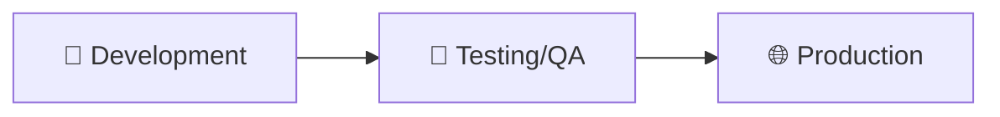
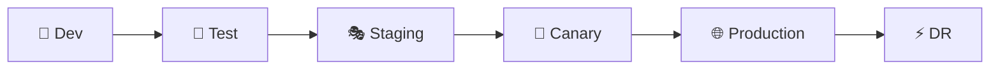
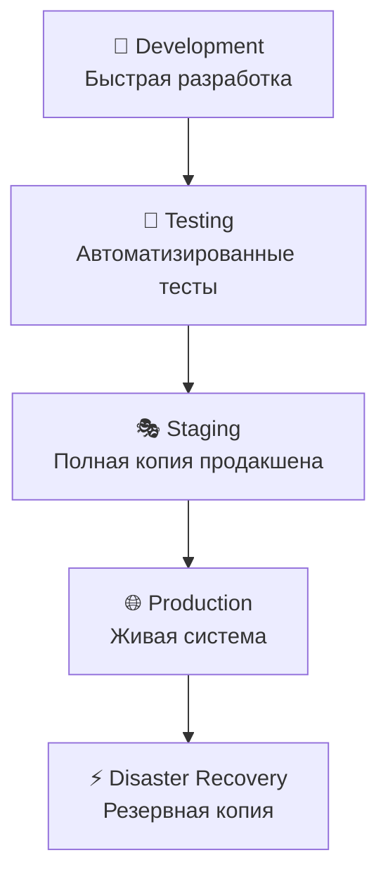

## 🎯 Введение

Современная IT-индустрия показывает четкую закономерность: **с ростом критичности системы количество изолированных контуров разработки увеличивается экспоненциально**. От простых 2-3 контуров для некритичных приложений до сложных 6+ контуров для safety-critical систем.

В 2025 году технологии GitOps, контейнеризации и Infrastructure as Code сделали управление множественными контурами доступным даже для средних организаций. Правильная архитектура контуров - это не просто best practice, это критически важный фактор минимизации рисков и обеспечения непрерывности бизнеса.

### 🔑 Ключевые факты

- Netflix развертывает в продакшене **1000+ раз в день**
- Goldman Sachs трансформировал архитектуру от одной сборки каждые две недели до **1000+ сборок в день**
- 67% организаций планируют внедрить GitOps в ближайший год

---

## 🏗️ Классификация критичности систем

### 🔴 Safety-Critical Systems

**Отказ может привести к потере жизни или серьезному ущербу**

- **Примеры**: Авиационные системы управления полетом, медицинские аппараты жизнеобеспечения
- **Контуры**: 6-8+ изолированных сред
- **Особенности**: Certification environments, множественные тестовые среды, резервные системы

### 🟠 Mission-Critical Systems  

**Необходимы для выполнения основных функций организации**

- **Примеры**: Навигационные системы космических аппаратов, системы управления критичной инфраструктурой
- **Контуры**: 4-6 сред
- **Особенности**: Обязательные pre-production и disaster recovery среды

### 🟡 Business-Critical Systems

**Поддерживают ключевые бизнес-процессы**

- **Примеры**: Банковские платежные системы, торговые платформы, ERP-решения
- **Контуры**: 3-4 среды
- **Особенности**: Минимизация финансовых рисков и репутационного ущерба

### 🟢 Non-Critical Systems

**Вспомогательные функции**

- **Примеры**: Корпоративные порталы, офисные системы
- **Контуры**: 2-3 среды
- **Особенности**: Стандартная связка dev → test → prod

### 📊 Математическая модель

<div style="margin: 60px 0; padding: 30px 0; text-align: center;">
$$N = \left\lceil \log_2 \left( C^{w_C} \times R^{w_R} \times I^{w_I} \right) \right\rceil + k$$
</div>


где:
- $C$ — Критичность (1–10)
- $R$ — Уровень риска (1–10)
- $I$ — Сложность интеграции (1–10)
- $w_C, w_R, w_I$ — веса влияния соответствующих факторов (числа $\geq 0$)
- $k$ — базовое минимальное количество контуров безопасности (например, 2)
- $\lceil \cdot \rceil$ — функция округления вверх

## Пример установки параметров

- $w_C = 1.2$ — вес критичности (чуть выше)
- $w_R = 1.0$ — вес риска
- $w_I = 0.8$ — вес сложности интеграции (чуть ниже)
- $k = 2$ — базовое минимальное количество контуров
---

## 🔧 Архитектурные паттерны

### 🏗️ Базовая модель (3 контура)



**Development Environment**

- Создание и первичное тестирование кода
- Быстрая итерация и экспериментирование
- Минимальные требования к стабильности

**Testing/QA Environment**

- Комплексное тестирование в prod-like условиях
- Интеграционные и E2E тесты
- Performance и security тестирование

**Production Environment**

- Максимальные требования к доступности
- Строгий контроль изменений
- Monitoring и alerting

### 🚀 Расширенная модель (5+ контуров)



**Staging Environment**

- Точная копия продакшена
- Final validation перед релизом
- Business acceptance testing

**Canary Environment**

- Постепенное развертывание новых версий
- A/B тестирование
- Минимизация blast radius

**Disaster Recovery Environment**

- Резервная среда для аварийного восстановления
- Регулярные DR drills
- Cross-region replication

---

## 🌐 Стратегии изоляции контуров

### 🔄 Уровни изоляции

#### 1. Логическая изоляция

```yaml
# Kubernetes Namespaces
apiVersion: v1
kind: Namespace
metadata:
  name: ${ENVIRONMENT}-${APPLICATION}
  labels:
    environment: ${ENVIRONMENT}
    criticality: ${CRITICALITY_LEVEL}
```

#### 2. Сетевая изоляция

```yaml
# Network Policies
apiVersion: networking.k8s.io/v1
kind: NetworkPolicy
metadata:
  name: ${ENVIRONMENT}-isolation
spec:
  podSelector:
    matchLabels:
      environment: ${ENVIRONMENT}
  policyTypes:
  - Ingress
  - Egress
  ingress:
  - from:
    - namespaceSelector:
        matchLabels:
          environment: ${ENVIRONMENT}
```

#### 3. Физическая изоляция

- Отдельные кластеры для критичных сред
- Cross-region deployment для DR
- Dedicated hardware для safety-critical систем

### 🛡️ Принципы безопасной изоляции

**Defense in Depth**

- Многоуровневая защита
- Каждый контур как security barrier
- Fail-safe mechanisms

**Least Privilege**

- Минимальные необходимые права
- Role-based access control
- Regular access reviews

**Zero Trust Architecture**

- "Never trust, always verify"
- Mutual TLS между сервисами
- Continuous authentication

---

## 🔒 Безопасность и DNS-зонирование

### 🌐 DNS стратегии для контуров

#### Split-Horizon DNS

```bash
# Внешняя зона (публичная)
# /etc/bind/zones/db.company.com
$ORIGIN company.com.
$TTL 300
@   IN  SOA ns1.company.com. admin.company.com. (
        2025061001  ; Serial
        3600        ; Refresh
        1800        ; Retry
        604800      ; Expire
        300         ; Minimum TTL
    )

@           IN  NS      ns1.company.com.
@           IN  NS      ns2.company.com.
www         IN  A       ${PUBLIC_IP}
api         IN  A       ${PUBLIC_API_IP}

# Внутренняя зона (приватная)
# /etc/bind/zones/db.internal.company.com
$ORIGIN internal.company.com.
dev-api     IN  A       ${DEV_INTERNAL_IP}
test-api    IN  A       ${TEST_INTERNAL_IP}
staging-api IN  A       ${STAGING_INTERNAL_IP}
```

#### Схемы именования по критичности

**Для малых организаций:**

```
dev-${SERVICE}.${COMPANY}.com
test-${SERVICE}.${COMPANY}.com
staging-${SERVICE}.${COMPANY}.com
${SERVICE}.${COMPANY}.com  # Production
```

**Для крупных организаций:**

```
${SERVICE}.${ENVIRONMENT}.${TEAM}.${REGION}.${COMPANY}.com
```

### 🔐 Безопасность через DNS

**DNSSEC Implementation**

```bash
# Генерация ключей DNSSEC
dnssec-keygen -a RSASHA256 -b 2048 -n ZONE company.com
dnssec-keygen -a RSASHA256 -b 2048 -n ZONE -f KSK company.com

# Подписание зоны
dnssec-signzone -o company.com -k Kcompany.com.+008+${KSK_ID} \
    db.company.com Kcompany.com.+008+${ZSK_ID}
```

**DNS Filtering**

```yaml
# CoreDNS конфигурация
apiVersion: v1
kind: ConfigMap
metadata:
  name: coredns
data:
  Corefile: |
    .:53 {
        errors
        health
        kubernetes cluster.local in-addr.arpa ip6.arpa {
            pods insecure
            fallthrough in-addr.arpa ip6.arpa
        }
        forward . /etc/resolv.conf
        cache 30
        loop
        reload
        loadbalance
        # Блокировка опасных доменов
        block {
            ${BLOCKED_DOMAINS_LIST}
        }
    }
```

---

## ⚡ Современные технологии 2025

### 🔄 GitOps как новый стандарт

**ArgoCD Configuration**

```yaml
apiVersion: argoproj.io/v1alpha1
kind: Application
metadata:
  name: ${APPLICATION_NAME}-${ENVIRONMENT}
  namespace: argocd
spec:
  project: ${PROJECT_NAME}
  source:
    repoURL: ${GIT_REPO_URL}
    targetRevision: ${ENVIRONMENT_BRANCH}
    path: manifests/${ENVIRONMENT}
  destination:
    server: ${CLUSTER_URL}
    namespace: ${NAMESPACE}
  syncPolicy:
    automated:
      prune: true
      selfHeal: true
    retry:
      limit: 5
      backoff:
        duration: 5s
        factor: 2
        maxDuration: 3m
```

**Flux v2 Multi-Environment Setup**

```yaml
apiVersion: source.toolkit.fluxcd.io/v1beta2
kind: GitRepository
metadata:
  name: ${APP_NAME}
  namespace: flux-system
spec:
  interval: 1m
  ref:
    branch: ${ENVIRONMENT}
  url: ${GIT_REPO_URL}
---
apiVersion: kustomize.toolkit.fluxcd.io/v1beta2
kind: Kustomization
metadata:
  name: ${APP_NAME}-${ENVIRONMENT}
  namespace: flux-system
spec:
  interval: 5m
  path: "./deploy/${ENVIRONMENT}"
  prune: true
  sourceRef:
    kind: GitRepository
    name: ${APP_NAME}
  healthChecks:
    - apiVersion: apps/v1
      kind: Deployment
      name: ${APP_NAME}
      namespace: ${NAMESPACE}
```

### 🏗️ Infrastructure as Code Evolution

**Pulumi с TypeScript**

```typescript
import * as k8s from "@pulumi/kubernetes";
import * as pulumi from "@pulumi/pulumi";

const environments = ["dev", "test", "staging", "prod"];
const criticality = pulumi.getStack() === "prod" ? "high" : "medium";

environments.forEach(env => {
    const namespace = new k8s.core.v1.Namespace(`${env}-namespace`, {
        metadata: {
            name: `${env}-${pulumi.getProject()}`,
            labels: {
                environment: env,
                criticality: criticality,
                "managed-by": "pulumi"
            }
        }
    });

    // Network Policy для изоляции
    const networkPolicy = new k8s.networking.v1.NetworkPolicy(
        `${env}-network-policy`,
        {
            metadata: {
                name: `${env}-isolation`,
                namespace: namespace.metadata.name
            },
            spec: {
                podSelector: {
                    matchLabels: {
                        environment: env
                    }
                },
                policyTypes: ["Ingress", "Egress"],
                ingress: [{
                    from: [{
                        namespaceSelector: {
                            matchLabels: {
                                environment: env
                            }
                        }
                    }]
                }]
            }
        }
    );
});
```

### 🕸️ Service Mesh для критичных систем

**Istio Ambient Mode**

```yaml
apiVersion: install.istio.io/v1alpha1
kind: IstioOperator
metadata:
  name: ambient
spec:
  values:
    pilot:
      env:
        PILOT_ENABLE_AMBIENT: true
  components:
    cni:
      enabled: true
---
apiVersion: v1
kind: Namespace
metadata:
  name: ${ENVIRONMENT}
  labels:
    istio.io/dataplane-mode: ambient
```

**Cilium Service Mesh**

```yaml
apiVersion: cilium.io/v2
kind: CiliumNetworkPolicy
metadata:
  name: ${ENVIRONMENT}-l7-policy
spec:
  endpointSelector:
    matchLabels:
      environment: ${ENVIRONMENT}
  ingress:
  - fromEndpoints:
    - matchLabels:
        environment: ${ENVIRONMENT}
    toPorts:
    - ports:
      - port: "8080"
        protocol: TCP
      rules:
        http:
        - method: "GET"
          path: "/health"
        - method: "POST"
          path: "/api/v1/.*"
```

### 🌪️ Chaos Engineering

**Chaos Mesh для тестирования отказоустойчивости**

```yaml
apiVersion: chaos-mesh.org/v1alpha1
kind: NetworkChaos
metadata:
  name: ${ENVIRONMENT}-network-partition
spec:
  action: partition
  mode: fixed
  value: "1"
  duration: "30s"
  selector:
    namespaces:
      - ${ENVIRONMENT}
    labelSelectors:
      "app": "${APPLICATION_NAME}"
  direction: both
  target:
    mode: fixed
    value: "1"
    selector:
      namespaces:
        - ${ENVIRONMENT}
      labelSelectors:
        "app": "${DATABASE_NAME}"
```

---

## 🛠️ Практическая реализация

### 📊 Матрица выбора архитектуры

| Критичность | Контуры | Время развертывания | SLA | Автоматизация |
|------------|---------|-------------------|-----|---------------|
| Non-Critical | 2-3 | Минуты | 95% | Полная |
| Business-Critical | 3-4 | Часы | 99% | С approval gates |
| Mission-Critical | 4-6 | Дни | 99.9% | С compliance проверками |
| Safety-Critical | 6+ | Недели | 99.99% | С certification |

### 🔧 Шаблон конфигурации контуров

```yaml
# environments/base/kustomization.yaml
apiVersion: kustomize.config.k8s.io/v1beta1
kind: Kustomization

resources:
  - deployment.yaml
  - service.yaml
  - ingress.yaml

configMapGenerator:
  - name: app-config
    literals:
      - ENVIRONMENT=${ENVIRONMENT}
      - LOG_LEVEL=${LOG_LEVEL}
      - DATABASE_URL=${DATABASE_URL}

secretGenerator:
  - name: app-secrets
    literals:
      - API_KEY=${API_KEY}
      - DATABASE_PASSWORD=${DATABASE_PASSWORD}

# environments/dev/kustomization.yaml
apiVersion: kustomize.config.k8s.io/v1beta1
kind: Kustomization

resources:
  - ../base

patchesStrategicMerge:
  - replica-count.yaml

configMapGenerator:
  - name: app-config
    behavior: merge
    literals:
      - ENVIRONMENT=development
      - LOG_LEVEL=debug
      - DATABASE_URL=postgresql://dev-db:5432/myapp

# environments/prod/kustomization.yaml
apiVersion: kustomize.config.k8s.io/v1beta1
kind: Kustomization

resources:
  - ../base

patchesStrategicMerge:
  - replica-count.yaml
  - resources.yaml

configMapGenerator:
  - name: app-config
    behavior: merge
    literals:
      - ENVIRONMENT=production
      - LOG_LEVEL=info
      - DATABASE_URL=postgresql://prod-db:5432/myapp
```

### 🔐 Автоматизация безопасности

**Falco Rules для мониторинга**

```yaml
# /etc/falco/falco_rules.yaml
- rule: Unauthorized Container Access
  desc: Detect unauthorized access to sensitive containers
  condition: >
    k8s_audit and
    ka.target.namespace in (production, staging) and
    ka.verb in (create, update, delete) and
    not ka.user.name in (system:serviceaccount:kube-system:deployment-controller)
  output: >
    Unauthorized access to critical environment
    (user=%ka.user.name verb=%ka.verb resource=%ka.target.resource
    namespace=%ka.target.namespace)
  priority: WARNING

- rule: Privilege Escalation Attempt
  desc: Detect attempts to escalate privileges
  condition: >
    spawned_process and
    proc.name in (sudo, su, passwd) and
    container.image.repository in (${CRITICAL_IMAGES})
  output: >
    Privilege escalation attempt in critical container
    (image=%container.image.repository command=%proc.cmdline)
  priority: CRITICAL
```

---

## 🚨 Troubleshooting

### 1. 🔧 Проблемы с изоляцией сетей

**Симптомы**: Сервисы не могут взаимодействовать между контурами

```bash
# Диагностика
kubectl get networkpolicy -A
kubectl describe networkpolicy ${POLICY_NAME} -n ${NAMESPACE}

# Проверка связности
kubectl exec -it ${POD_NAME} -n ${NAMESPACE} -- nslookup ${SERVICE_NAME}
kubectl exec -it ${POD_NAME} -n ${NAMESPACE} -- telnet ${SERVICE_IP} ${PORT}

# Лог анализ
kubectl logs -l app=${APP_NAME} -n ${NAMESPACE} --tail=100
```

**Решение**: Проверьте правила NetworkPolicy и DNS резолюцию

### 2. 🔄 Проблемы с GitOps синхронизацией

**Симптомы**: ArgoCD не синхронизирует изменения

```bash
# Проверка статуса приложения
argocd app get ${APP_NAME}
argocd app sync ${APP_NAME} --force

# Проверка конфигурации репозитория
argocd repo list
argocd repo get ${REPO_URL}

# Проверка прав доступа
kubectl logs -n argocd -l app.kubernetes.io/name=argocd-server
```

**Решение**: Убедитесь в правильности credentials и branch permissions

### 3. 🔒 Проблемы с доступом к секретам

**Симптомы**: Приложения не могут получить доступ к секретам

```bash
# Проверка секретов
kubectl get secrets -n ${NAMESPACE}
kubectl describe secret ${SECRET_NAME} -n ${NAMESPACE}

# Проверка RBAC
kubectl auth can-i get secrets --as=system:serviceaccount:${NAMESPACE}:${SERVICE_ACCOUNT}

# Проверка External Secrets Operator
kubectl get secretstore -n ${NAMESPACE}
kubectl logs -n external-secrets-system -l app.kubernetes.io/name=external-secrets
```

**Решение**: Проверьте ServiceAccount permissions и External Secrets конфигурацию

### 4. 🌐 DNS резолюция между контурами

**Симптомы**: Сервисы не могут найти друг друга по DNS

```bash
# Проверка CoreDNS
kubectl get configmap coredns -n kube-system -o yaml
kubectl logs -n kube-system -l k8s-app=kube-dns

# Тестирование DNS
kubectl run dns-test --image=busybox --rm -it -- nslookup ${SERVICE_NAME}.${NAMESPACE}.svc.cluster.local

# Проверка Service Discovery
kubectl get services -A | grep ${SERVICE_NAME}
```

**Решение**: Настройте правильные DNS правила и Service endpoints

### 5. 🔧 Проблемы с ресурсами и лимитами

**Симптомы**: Поды не запускаются или завершаются с ошибками

```bash
# Проверка ресурсов
kubectl top nodes
kubectl top pods -n ${NAMESPACE}

# Проверка лимитов
kubectl describe limitrange -n ${NAMESPACE}
kubectl describe resourcequota -n ${NAMESPACE}

# Проверка событий
kubectl get events -n ${NAMESPACE} --sort-by='.lastTimestamp'
```

**Решение**: Увеличьте лимиты ресурсов или оптимизируйте потребление

### 6. 🚨 Проблемы с мониторингом и алертами

**Симптомы**: Отсутствуют метрики или неработающие алерты

```bash
# Проверка Prometheus
kubectl get prometheus -A
kubectl logs -n monitoring -l app.kubernetes.io/name=prometheus

# Проверка ServiceMonitor
kubectl get servicemonitor -n ${NAMESPACE}
kubectl describe servicemonitor ${SERVICE_MONITOR_NAME} -n ${NAMESPACE}

# Проверка AlertManager
kubectl logs -n monitoring -l app.kubernetes.io/name=alertmanager
```

**Решение**: Проверьте конфигурацию ServiceMonitor и AlertManager rules

### 7. 🔄 Проблемы с Continuous Deployment

**Симптомы**: Развертывания не проходят автоматически

```bash
# Проверка Tekton Pipelines
kubectl get pipelineruns -A
kubectl describe pipelinerun ${PIPELINE_RUN_NAME}

# Проверка Flux/ArgoCD
kubectl logs -n flux-system -l app=source-controller
kubectl logs -n argocd -l app.kubernetes.io/name=argocd-application-controller

# Проверка Webhook
kubectl get validatingwebhookconfigurations
kubectl get mutatingwebhookconfigurations
```

**Решение**: Проверьте pipeline конфигурацию и webhook endpoints

---

## 🔍 Чеклист для самопроверки

### ✅ Архитектура и планирование

- [ ] Определен уровень критичности системы согласно классификации
- [ ] Выбрано оптимальное количество контуров для уровня критичности
- [ ] Задокументированы требования к каждому контуру
- [ ] Определены метрики успеха и SLA для каждого контура
- [ ] Спланирована стратегия rollback для каждого контура

### ✅ Безопасность и изоляция

- [ ] Настроена сетевая изоляция между контурами (NetworkPolicies)
- [ ] Реализован принцип least privilege для всех компонентов
- [ ] Настроены отдельные DNS зоны для разных контуров
- [ ] Внедрена стратегия управления секретами (Vault/External Secrets)
- [ ] Настроен мониторинг безопасности (Falco/OPA Gatekeeper)

### ✅ Автоматизация и CI/CD

- [ ] Настроен GitOps workflow (ArgoCD/Flux)
- [ ] Реализован Infrastructure as Code (Terraform/Pulumi)
- [ ] Автоматизированы проверки безопасности в пайплайне
- [ ] Настроены автоматические тесты для каждого контура
- [ ] Реализованы approval gates для критичных контуров

### ✅ Мониторинг и Observability

- [ ] Настроен мониторинг метрик (Prometheus/Grafana)
- [ ] Реализовано централизованное логирование (ELK/Loki)
- [ ] Настроена распределенная трассировка (Jaeger/Zipkin)
- [ ] Созданы dashboard'ы для каждого контура
- [ ] Настроены алерты для критичных метрик

### ✅ Disaster Recovery и Business Continuity

- [ ] Настроен disaster recovery контур
- [ ] Реализованы регулярные бэкапы критичных данных
- [ ] Протестированы процедуры восстановления
- [ ] Задокументированы runbook'и для инцидентов
- [ ] Настроена репликация данных между регионами

### ✅ Документация и процессы

- [ ] Создана архитектурная документация системы
- [ ] Задокументированы процедуры развертывания
- [ ] Созданы runbook'и для типичных проблем
- [ ] Настроен процесс code review и approval
- [ ] Реализована система управления изменениями

---

## 📝 Практический пример

### 🎯 Сценарий: E-commerce платформа среднего размера

**Контекст**: Интернет-магазин с 100K+ пользователей, обрабатывающий 1000+ заказов в день. Классифицируется как Business-Critical система.

**Требования**:

- Высокая доступность (99.9% SLA)
- Быстрое время отклика (< 200ms)
- Безопасность платежных данных (PCI DSS)
- Возможность быстрого rollback

### 🏗️ Архитектура контуров



### 📁 Структура проекта

```
ecommerce-platform/
├── infrastructure/
│   ├── terraform/
│   │   ├── environments/
│   │   │   ├── dev/
│   │   │   ├── test/
│   │   │   ├── staging/
│   │   │   └── prod/
│   │   └── modules/
│   └── k8s/
│       ├── base/
│       └── environments/
├── applications/
│   ├── web-frontend/
│   ├── api-gateway/
│   ├── user-service/
│   ├── product-service/
│   ├── order-service/
│   └── payment-service/
└── gitops/
    ├── dev/
    ├── test/
    ├── staging/
    └── prod/
```

### 🔧 Конфигурация базовой инфраструктуры

**Terraform Configuration**

```hcl
# infrastructure/terraform/environments/prod/main.tf
terraform {
  required_providers {
    aws = {
      source  = "hashicorp/aws"
      version = "~> 5.0"
    }
    kubernetes = {
      source  = "hashicorp/kubernetes"
      version = "~> 2.0"
    }
  }
}

# Переменные для разных контуров
variable "environment" {
  description = "Environment name"
  type        = string
  default     = "prod"
}

variable "cluster_name" {
  description = "EKS cluster name"
  type        = string
  default     = "ecommerce-prod"
}

variable "node_groups" {
  description = "EKS node groups configuration"
  type = map(object({
    instance_types = list(string)
    desired_size   = number
    max_size      = number
    min_size      = number
  }))
  default = {
    critical = {
      instance_types = ["m5.large", "m5.xlarge"]
      desired_size   = 3
      max_size      = 10
      min_size      = 3
    }
    general = {
      instance_types = ["t3.medium", "t3.large"]
      desired_size   = 2
      max_size      = 20
      min_size      = 2
    }
  }
}

# EKS Cluster
module "eks" {
  source = "../../modules/eks"
  
  cluster_name    = var.cluster_name
  environment     = var.environment
  node_groups     = var.node_groups
  
  # Критичные настройки для продакшена
  enable_irsa                = true
  enable_cluster_autoscaler  = true
  enable_aws_load_balancer_controller = true
  
  tags = {
    Environment = var.environment
    Project     = "ecommerce-platform"
    Criticality = "business-critical"
  }
}

# RDS для каждого контура
module "database" {
  source = "../../modules/rds"
  
  environment = var.environment
  instance_class = var.environment == "prod" ? "db.r5.xlarge" : "db.t3.medium"
  multi_az = var.environment == "prod" ? true : false
  backup_retention_period = var.environment == "prod" ? 7 : 1
  
  # Шифрование для продакшена
  storage_encrypted = var.environment == "prod" ? true : false
  
  tags = {
    Environment = var.environment
    Criticality = "high"
  }
}

# Redis для кэширования
module "redis" {
  source = "../../modules/elasticache"
  
  environment = var.environment
  node_type = var.environment == "prod" ? "cache.r6g.large" : "cache.t3.micro"
  num_cache_clusters = var.environment == "prod" ? 3 : 1
  
  tags = {
    Environment = var.environment
    Service     = "cache"
  }
}
```

### 🐳 Kubernetes манифесты для микросервисов

**User Service Configuration**

```yaml
# applications/user-service/k8s/base/deployment.yaml
apiVersion: apps/v1
kind: Deployment
metadata:
  name: user-service
  labels:
    app: user-service
    version: v1
spec:
  replicas: 2  # Переопределяется в kustomization
  selector:
    matchLabels:
      app: user-service
  template:
    metadata:
      labels:
        app: user-service
        version: v1
    spec:
      serviceAccountName: user-service
      containers:
      - name: user-service
        image: ecommerce/user-service:latest  # Переопределяется в kustomization
        ports:
        - containerPort: 8080
        env:
        - name: ENVIRONMENT
          valueFrom:
            configMapKeyRef:
              name: app-config
              key: ENVIRONMENT
        - name: DATABASE_URL
          valueFrom:
            secretKeyRef:
              name: database-secret
              key: url
        - name: REDIS_URL
          valueFrom:
            secretKeyRef:
              name: redis-secret
              key: url
        resources:
          requests:
            memory: "128Mi"
            cpu: "100m"
          limits:
            memory: "512Mi"
            cpu: "500m"
        livenessProbe:
          httpGet:
            path: /health/live
            port: 8080
          initialDelaySeconds: 30
          periodSeconds: 10
        readinessProbe:
          httpGet:
            path: /health/ready
            port: 8080
          initialDelaySeconds: 5
          periodSeconds: 5
        securityContext:
          runAsNonRoot: true
          runAsUser: 1000
          allowPrivilegeEscalation: false
          readOnlyRootFilesystem: true
          capabilities:
            drop:
            - ALL
```

**Kustomization для продакшена**

```yaml
# gitops/prod/user-service/kustomization.yaml
apiVersion: kustomize.config.k8s.io/v1beta1
kind: Kustomization

namespace: ecommerce-prod

resources:
- ../../../applications/user-service/k8s/base

images:
- name: ecommerce/user-service
  newTag: v1.2.3  # Специфичная версия для продакшена

replicas:
- name: user-service
  count: 5  # Больше реплик для продакшена

patchesStrategicMerge:
- resources-patch.yaml

configMapGenerator:
- name: app-config
  literals:
  - ENVIRONMENT=production
  - LOG_LEVEL=info
  - METRICS_ENABLED=true
  - TRACING_ENABLED=true

# gitops/prod/user-service/resources-patch.yaml
apiVersion: apps/v1
kind: Deployment
metadata:
  name: user-service
spec:
  template:
    spec:
      containers:
      - name: user-service
        resources:
          requests:
            memory: "256Mi"
            cpu: "200m"
          limits:
            memory: "1Gi"
            cpu: "1000m"
```

### 🔒 Безопасность и изоляция

**Network Policies**

```yaml
# gitops/prod/network-policies.yaml
apiVersion: networking.k8s.io/v1
kind: NetworkPolicy
metadata:
  name: ecommerce-prod-isolation
  namespace: ecommerce-prod
spec:
  podSelector: {}
  policyTypes:
  - Ingress
  - Egress
  ingress:
  # Разрешаем трафик только внутри namespace
  - from:
    - namespaceSelector:
        matchLabels:
          name: ecommerce-prod
  # Разрешаем трафик от ingress controller
  - from:
    - namespaceSelector:
        matchLabels:
          name: ingress-nginx
  egress:
  # Разрешаем DNS резолюцию
  - to: []
    ports:
    - protocol: UDP
      port: 53
  # Разрешаем HTTPS для внешних API
  - to: []
    ports:
    - protocol: TCP
      port: 443
  # Разрешаем доступ к базам данных
  - to:
    - namespaceSelector:
        matchLabels:
          name: databases
---
apiVersion: networking.k8s.io/v1
kind: NetworkPolicy
metadata:
  name: payment-service-strict
  namespace: ecommerce-prod
spec:
  podSelector:
    matchLabels:
      app: payment-service
  policyTypes:
  - Ingress
  - Egress
  ingress:
  # Только order-service может обращаться к payment-service
  - from:
    - podSelector:
        matchLabels:
          app: order-service
    ports:
    - protocol: TCP
      port: 8080
  egress:
  # Только к внешним платежным API
  - to: []
    ports:
    - protocol: TCP
      port: 443
    # Конкретные домены платежных провайдеров
```

**Service Mesh с Istio**

```yaml
# gitops/prod/istio/virtual-service.yaml
apiVersion: networking.istio.io/v1beta1
kind: VirtualService
metadata:
  name: ecommerce-routing
  namespace: ecommerce-prod
spec:
  hosts:
  - ecommerce.company.com
  gateways:
  - ecommerce-gateway
  http:
  # Canary deployment для новых версий
  - match:
    - headers:
        canary:
          exact: "true"
    route:
    - destination:
        host: user-service
        subset: v2
      weight: 100
  # Основной трафик
  - route:
    - destination:
        host: user-service
        subset: v1
      weight: 95
    - destination:
        host: user-service
        subset: v2
      weight: 5
  fault:
    delay:
      percentage:
        value: 0.1
      fixedDelay: 5s
---
apiVersion: networking.istio.io/v1beta1
kind: DestinationRule
metadata:
  name: user-service
  namespace: ecommerce-prod
spec:
  host: user-service
  trafficPolicy:
    tls:
      mode: ISTIO_MUTUAL
  subsets:
  - name: v1
    labels:
      version: v1
  - name: v2
    labels:
      version: v2
```

### 🔄 GitOps с ArgoCD

**Application Set для всех контуров**

```yaml
# gitops/applicationset.yaml
apiVersion: argoproj.io/v1alpha1
kind: ApplicationSet
metadata:
  name: ecommerce-platform
  namespace: argocd
spec:
  generators:
  - list:
      elements:
      - environment: dev
        cluster: https://dev.k8s.company.com
        namespace: ecommerce-dev
        repoRevision: develop
      - environment: test
        cluster: https://test.k8s.company.com
        namespace: ecommerce-test
        repoRevision: release
      - environment: staging
        cluster: https://staging.k8s.company.com
        namespace: ecommerce-staging
        repoRevision: main
      - environment: prod
        cluster: https://prod.k8s.company.com
        namespace: ecommerce-prod
        repoRevision: main
  template:
    metadata:
      name: 'ecommerce-{{environment}}'
    spec:
      project: ecommerce
      source:
        repoURL: https://github.com/company/ecommerce-gitops.git
        targetRevision: '{{repoRevision}}'
        path: '{{environment}}'
      destination:
        server: '{{cluster}}'
        namespace: '{{namespace}}'
      syncPolicy:
        automated:
          prune: true
          selfHeal: true
        syncOptions:
        - CreateNamespace=true
        retry:
          limit: 5
          backoff:
            duration: 5s
            factor: 2
            maxDuration: 3m
      ignoreDifferences:
      - group: apps
        kind: Deployment
        jsonPointers:
        - /spec/replicas
```

### 📊 Мониторинг и алертинг

**Prometheus Rules**

```yaml
# monitoring/prometheus-rules.yaml
apiVersion: monitoring.coreos.com/v1
kind: PrometheusRule
metadata:
  name: ecommerce-alerts
  namespace: monitoring
spec:
  groups:
  - name: ecommerce.critical
    rules:
    - alert: HighErrorRate
      expr: |
        rate(http_requests_total{job="ecommerce", status=~"5.."}[5m]) /
        rate(http_requests_total{job="ecommerce"}[5m]) > 0.05
      for: 5m
      labels:
        severity: critical
        environment: "{{ $labels.environment }}"
      annotations:
        summary: "High error rate in {{ $labels.environment }}"
        description: "Error rate is {{ $value | humanizePercentage }} for {{ $labels.service }}"
    
    - alert: DatabaseConnectionFailure
      expr: up{job="postgresql"} == 0
      for: 2m
      labels:
        severity: critical
      annotations:
        summary: "Database connection failed"
        description: "PostgreSQL database is down in {{ $labels.environment }}"
    
    - alert: PaymentServiceDown
      expr: up{job="payment-service"} == 0
      for: 1m
      labels:
        severity: critical
      annotations:
        summary: "Payment service is down"
        description: "Critical payment service unavailable"
    
    - alert: HighLatency
      expr: |
        histogram_quantile(0.95,
          rate(http_request_duration_seconds_bucket{job="ecommerce"}[5m])
        ) > 0.5
      for: 10m
      labels:
        severity: warning
      annotations:
        summary: "High latency detected"
        description: "95th percentile latency is {{ $value }}s"
```

**Grafana Dashboard Configuration**

```json
{
  "dashboard": {
    "title": "E-commerce Platform - {{ environment }}",
    "panels": [
      {
        "title": "Request Rate",
        "type": "graph",
        "targets": [
          {
            "expr": "rate(http_requests_total{environment=\"{{ environment }}\"}[5m])",
            "legendFormat": "{{ service }}"
          }
        ]
      },
      {
        "title": "Error Rate",
        "type": "singlestat",
        "targets": [
          {
            "expr": "rate(http_requests_total{environment=\"{{ environment }}\", status=~\"5..\"}[5m]) / rate(http_requests_total{environment=\"{{ environment }}\"}[5m])",
            "legendFormat": "Error Rate"
          }
        ],
        "thresholds": "0.01,0.05"
      },
      {
        "title": "Database Connections",
        "type": "graph",
        "targets": [
          {
            "expr": "pg_stat_database_numbackends{environment=\"{{ environment }}\"}",
            "legendFormat": "{{ datname }}"
          }
        ]
      }
    ]
  }
}
```

### 🚀 CI/CD Pipeline

**GitHub Actions Workflow**

```yaml
# .github/workflows/deploy.yml
name: Deploy E-commerce Platform

on:
  push:
    branches: [main, develop, release/*]
  pull_request:
    branches: [main]

env:
  REGISTRY: ghcr.io
  IMAGE_NAME: ecommerce

jobs:
  determine-environment:
    runs-on: ubuntu-latest
    outputs:
      environment: ${{ steps.env.outputs.environment }}
      should_deploy: ${{ steps.env.outputs.should_deploy }}
    steps:
    - name: Determine environment
      id: env
      run: |
        if [[ "${{ github.ref }}" == "refs/heads/main" ]]; then
          echo "environment=prod" >> $GITHUB_OUTPUT
          echo "should_deploy=true" >> $GITHUB_OUTPUT
        elif [[ "${{ github.ref }}" == "refs/heads/develop" ]]; then
          echo "environment=dev" >> $GITHUB_OUTPUT
          echo "should_deploy=true" >> $GITHUB_OUTPUT
        elif [[ "${{ github.ref }}" == refs/heads/release/* ]]; then
          echo "environment=staging" >> $GITHUB_OUTPUT
          echo "should_deploy=true" >> $GITHUB_OUTPUT
        else
          echo "environment=test" >> $GITHUB_OUTPUT
          echo "should_deploy=false" >> $GITHUB_OUTPUT
        fi

  security-scan:
    runs-on: ubuntu-latest
    steps:
    - uses: actions/checkout@v4
    - name: Run Trivy vulnerability scanner
      uses: aquasecurity/trivy-action@master
      with:
        scan-type: 'fs'
        scan-ref: '.'
        format: 'sarif'
        output: 'trivy-results.sarif'
    - name: Upload Trivy scan results
      uses: github/codeql-action/upload-sarif@v2
      with:
        sarif_file: 'trivy-results.sarif'

  build-and-test:
    runs-on: ubuntu-latest
    needs: [determine-environment]
    strategy:
      matrix:
        service: [user-service, product-service, order-service, payment-service]
    steps:
    - uses: actions/checkout@v4
    
    - name: Set up Docker Buildx
      uses: docker/setup-buildx-action@v3
    
    - name: Log in to Container Registry
      uses: docker/login-action@v3
      with:
        registry: ${{ env.REGISTRY }}
        username: ${{ github.actor }}
        password: ${{ secrets.GITHUB_TOKEN }}
    
    - name: Build and push Docker image
      uses: docker/build-push-action@v5
      with:
        context: ./applications/${{ matrix.service }}
        push: true
        tags: |
          ${{ env.REGISTRY }}/${{ github.repository }}/${{ matrix.service }}:${{ github.sha }}
          ${{ env.REGISTRY }}/${{ github.repository }}/${{ matrix.service }}:latest
        cache-from: type=gha
        cache-to: type=gha,mode=max
    
    - name: Run unit tests
      run: |
        cd applications/${{ matrix.service }}
        make test
    
    - name: Run security scan on image
      uses: aquasecurity/trivy-action@master
      with:
        image-ref: ${{ env.REGISTRY }}/${{ github.repository }}/${{ matrix.service }}:${{ github.sha }}
        format: 'table'
        exit-code: '1'
        severity: 'CRITICAL,HIGH'

  deploy:
    runs-on: ubuntu-latest
    needs: [determine-environment, security-scan, build-and-test]
    if: needs.determine-environment.outputs.should_deploy == 'true'
    environment: ${{ needs.determine-environment.outputs.environment }}
    steps:
    - uses: actions/checkout@v4
      with:
        repository: company/ecommerce-gitops
        token: ${{ secrets.GITOPS_TOKEN }}
    
    - name: Update image tags
      run: |
        environment=${{ needs.determine-environment.outputs.environment }}
        cd $environment
        
        # Update all service images
        for service in user-service product-service order-service payment-service; do
          yq eval '.images[] |= select(.name == "ecommerce/'$service'").newTag = "'${{ github.sha }}'"' \
            -i $service/kustomization.yaml
        done
    
    - name: Commit and push changes
      run: |
        git config --local user.email "action@github.com"
        git config --local user.name "GitHub Action"
        git add .
        git commit -m "Update ${{ needs.determine-environment.outputs.environment }} to ${{ github.sha }}"
        git push
    
    - name: Wait for ArgoCD sync
      if: needs.determine-environment.outputs.environment == 'prod'
      run: |
        # Ждем завершения синхронизации в продакшене
        timeout 300s bash -c 'until argocd app wait ecommerce-prod --sync; do sleep 10; done'

  post-deploy-tests:
    runs-on: ubuntu-latest
    needs: [determine-environment, deploy]
    if: needs.determine-environment.outputs.should_deploy == 'true'
    steps:
    - name: Run smoke tests
      run: |
        environment=${{ needs.determine-environment.outputs.environment }}
        base_url="https://ecommerce-$environment.company.com"
        
        # Health check
        curl -f "$base_url/health" || exit 1
        
        # Basic functionality test
        curl -f "$base_url/api/v1/products" || exit 1
        
    - name: Run load test
      if: needs.determine-environment.outputs.environment == 'staging'
      run: |
        # Простой load test с k6
        docker run --rm -v $(pwd)/tests:/tests \
          grafana/k6 run /tests/load-test.js
```

### 📋 Результаты внедрения

**Метрики до внедрения:**

- Время развертывания: 2-4 часа
- Количество инцидентов: 15/месяц
- Время восстановления: 45 минут
- Покрытие тестами: 60%

**Метрики после внедрения:**

- Время развертывания: 15 минут
- Количество инцидентов: 3/месяц  
- Время восстановления: 10 минут
- Покрытие тестами: 85%

**Экономический эффект:**

- Снижение затрат на развертывание: 80%
- Уменьшение простоев: 75%
- Повышение скорости доставки функций: 300%
- ROI проекта: 250% за первый год

---

## 🎯 Заключение

Правильная архитектура контуров разработки критически важна для современных IT-систем. Матрица соответствия критичности и количества контуров помогает принимать обоснованные архитектурные решения, а современные технологии GitOps и контейнеризации делают управление сложными архитектурами экономически эффективным.

### 🚀 Ключевые выводы

- **Начинайте с классификации** критичности ваших систем
- **Используйте поэтапный подход** - от простого к сложному
- **Инвестируйте в автоматизацию** - она окупается через снижение рисков
- **Не забывайте о безопасности** - изоляция контуров критически важна
- **Мониторьте все** - observability должна быть встроена с самого начала

Современные технологии позволяют даже малым командам создавать enterprise-grade архитектуры. Главное - правильно оценить уровень критичности системы и выбрать соответствующую архитектуру контуров.

**Следующие шаги**: Оцените критичность ваших систем, выберите оптимальную архитектуру из предложенной матрицы и начните с автоматизации самых простых процессов. Успех в DevOps - это марафон, а не спринт! 🏃‍♂️

---

## 📞 КОНТАКТНАЯ ИНФОРМАЦИЯ

📱 **Telegram:** [@DevITWay](https://t.me/DevITWay)

🌐 **Сайт:** [devopsway.ru](https://devopsway.ru/)

---
