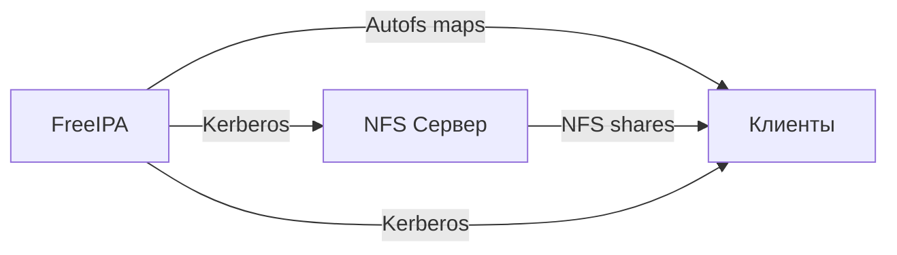

💾 **Категория:** Системное администрирование  
💡 **Цель:** Настроить безопасное NFS хранилище с автомонтированием

🧠 **Чему научитесь:**

- Безопасная настройка NFS (без no_root_squash!)
- Правильные параметры монтирования (hard vs soft)
- Autofs с FreeIPA LDAP
- Kerberos для NFS
- Решение проблем

⚠️ **Требования:**

- FreeIPA настроен ([часть 1](/posts/freeipa-setup/))
- RHEL/CentOS Stream/AlmaLinux/Rocky 8-9
- Статический IP
- Root доступ

**📚 Серия статей:**
1. [Установка FreeIPA](/posts/freeipa-setup/)
2. **NFS + Autofs** (эта статья)
3. [Hashicorp Vault интеграция](/posts/freeipa-vault-integration/)

---

## 🚨 Production vs Лаборатория

| Параметр | ❌ Лаборатория | ✅ Production |
|---|---|---|
| **NFS exports** | no_root_squash | root_squash |
| **Монтирование /home** | soft | hard,intr |
| **DNS** | chattr +i | NetworkManager |
| **Kerberos** | Опционально | Обязательно |
| **SELinux** | Permissive | Enforcing |

🔥 **Важно:** `no_root_squash` в production = нарушение безопасности!

---

## 🏗️ Архитектура



**Процесс монтирования:**

1. Пользователь заходит: `cd /home/username`
2. Autofs запрашивает LDAP через SSSD
3. FreeIPA возвращает путь к NFS
4. Autofs монтирует с Kerberos
5. Доступ предоставлен

---

## 💻 Требования

| Компонент | Требования |
|---|---|
| FreeIPA | Настроен |
| NFS Server | RHEL 8-9 |
| RAM | 1-2 GB |
| Диск | По потребностям |

---

## 🚀 Часть 1: NFS Сервер

### Настройка hostname и DNS

```bash
hostnamectl set-hostname nfs-server.example.com
```

**На FreeIPA:**

```bash
kinit admin
ipa dnsrecord-add example.com nfs-server --a-rec=192.168.1.20
```

**На NFS сервере (NetworkManager!):**

⚠️ **НЕ используйте `chattr +i`!**

```bash
# Определяем подключение
CONN_NAME=$(nmcli -t -f NAME,DEVICE con show --active | grep -v '^lo' | head -1 | cut -d: -f1)

# Настройка DNS
nmcli con mod "$CONN_NAME" ipv4.dns "192.168.1.10 8.8.8.8"
nmcli con mod "$CONN_NAME" ipv4.dns-search "example.com"
nmcli con mod "$CONN_NAME" ipv4.ignore-auto-dns yes
nmcli con up "$CONN_NAME"

# Проверка
nslookup nfs-server.example.com
```

**Почему не chattr +i:**
- Ломает NetworkManager
- Ломает systemd-resolved
- Проблемы при диагностике

### Установка NFS

```bash
dnf install -y nfs-utils rpcbind
systemctl enable --now rpcbind nfs-server
```

⚠️ **rpcbind:** Для NFSv4-only не обязателен, но рекомендуется для совместимости

### Firewall

```bash
firewall-cmd --permanent --add-service=nfs
firewall-cmd --permanent --add-service=mountd
firewall-cmd --permanent --add-service=rpc-bind
firewall-cmd --reload
```

### Структура директорий

```bash
mkdir -p /export/home
mkdir -p /export/shared/{docs,projects,scripts}

chmod 755 /export/home
chmod 755 /export/shared

cat > /export/shared/README.txt << EOF
FreeIPA NFS Storage
Server: $(hostname -f)
EOF
```

### NFS Exports (PRODUCTION!)

🚨 **КРИТИЧНО:** `no_root_squash` = SECURITY РИСК!

```bash
cat > /etc/exports << 'EOF'
# Production конфигурация - root_squash ОБЯЗАТЕЛЕН!

/export/home    192.168.1.0/24(rw,sync,root_squash,no_subtree_check)
/export/shared  192.168.1.0/24(rw,sync,root_squash,no_subtree_check)
EOF

exportfs -ra
exportfs -v
showmount -e localhost
```

⚠️ **О sec=sys:** На начальном этапе используется `sec=sys`. Далее переключаемся на Kerberos. В production Kerberos **обязателен**!

**Таблица параметров монтирования:**

| Сценарий | Параметры |
|---|---|
| /home | rw,hard,intr,sec=krb5p |
| /shared/docs | ro,soft,sec=krb5i |
| /shared/projects | rw,hard,intr,sec=krb5i |

**О no_root_squash:**
- Допустим ТОЛЬКО для backup серверов
- НИКОГДА для /home или /shared!
- Любой root на клиенте = root на NFS

### Регистрация в FreeIPA

```bash
# Установка клиента
dnf install -y ipa-client

# Подключение
ipa-client-install \
    --server=ipa-master.example.com \
    --domain=example.com \
    --realm=EXAMPLE.COM \
    --principal=admin \
    --mkhomedir \
    --enable-dns-updates \
    --unattended

kinit admin

# Host и service
ipa host-add nfs-server.example.com --ip-address=192.168.1.20
ipa service-add nfs/nfs-server.example.com

# Keytab
ipa-getkeytab -s ipa-master.example.com \
    -p nfs/nfs-server.example.com \
    -k /etc/krb5.keytab

# Проверка
klist -k /etc/krb5.keytab
```

### Создание домашних директорий

```bash
# Получаем через getent (надёжнее чем id!)
USERINFO=$(getent passwd testuser)
USERNAME=$(echo "$USERINFO" | cut -d: -f1)
UID=$(echo "$USERINFO" | cut -d: -f3)
GID=$(echo "$USERINFO" | cut -d: -f4)

mkdir -p "/export/home/$USERNAME"
chown "$UID:$GID" "/export/home/$USERNAME"
chmod 700 "/export/home/$USERNAME"

mkdir -p "/export/home/$USERNAME"/{Documents,Downloads,Projects}
chown -R "$UID:$GID" "/export/home/$USERNAME"
```

---

## 🗺️ Часть 2: Autofs в FreeIPA

### Создание Location

```bash
kinit admin

# Idempotent создание
ipa automountlocation-show default 2>/dev/null || \
ipa automountlocation-add default
```

### Map для /home

```bash
ipa automountmap-add default auto.home

ipa automountkey-add default auto.master \
    --key=/home \
    --info=auto.home

# ВАЖНО: hard mounts для /home!
ipa automountkey-add default auto.home \
    --key='*' \
    --info='-rw,hard,intr,sec=krb5p nfs-server.example.com:/export/home/&'
```

**О параметрах /home:**

| Параметр | Почему |
|---|---|
| hard | Без потери данных! soft → битые .ssh, .bashrc |
| intr | Прерывание зависших операций (для совместимости) |
| krb5p | Kerberos + шифрование |

**❌ НИКОГДА soft для /home!**

### Map для /shared

```bash
ipa automountmap-add default auto.shared

ipa automountkey-add default auto.master \
    --key=/shared \
    --info=auto.shared

# Read-only docs (soft OK)
ipa automountkey-add default auto.shared \
    --key=docs \
    --info='-ro,soft,sec=krb5i nfs-server.example.com:/export/shared/docs'

# Projects (hard!)
ipa automountkey-add default auto.shared \
    --key=projects \
    --info='-rw,hard,intr,sec=krb5i nfs-server.example.com:/export/shared/projects'
```

**Уровни безопасности Kerberos:**

| Уровень | Описание |
|---|---|
| krb5 | Аутентификация |
| krb5i | + Проверка целостности |
| krb5p | + Шифрование |

---

## 💻 Часть 3: Клиенты

### Подготовка

```bash
dnf install -y autofs nfs-utils
```

### DNS (NetworkManager!)

```bash
CONN_NAME=$(nmcli -t -f NAME,DEVICE con show --active | grep -v '^lo' | head -1 | cut -d: -f1)

nmcli con mod "$CONN_NAME" ipv4.dns "192.168.1.10 8.8.8.8"
nmcli con mod "$CONN_NAME" ipv4.ignore-auto-dns yes
nmcli con up "$CONN_NAME"

dig nfs-server.example.com
```

### Настройка Autofs

```bash
ipa-client-automount --location=default --unattended

# Проверка
automount -m
```

### Запуск

```bash
systemctl restart sssd
systemctl enable autofs --now
systemctl status autofs
```

---

## 🔒 Часть 4: Kerberos для NFS

### NFS сервер

```bash
# Уже получили keytab ранее

cat >> /etc/nfs.conf << 'EOF'

[nfsd]
vers4=y
vers4.0=y
vers4.1=y
vers4.2=y
EOF

# Обновление exports
cat > /etc/exports << 'EOF'
# Kerberos-secured

/export/home    192.168.1.0/24(rw,sync,sec=krb5p,root_squash,no_subtree_check)
/export/shared  192.168.1.0/24(rw,sync,sec=krb5i,root_squash,no_subtree_check)
EOF

exportfs -ra
systemctl restart nfs-server
```

### Клиент (проверка!)

⚠️ **КРИТИЧНО:** Проверить, что Kerberos работает!

```bash
su - testuser

# Проверка ticket
klist

# Переход в home (триггер монтирования)
cd /home/testuser

# Проверка параметров монтирования
mount | grep "/home/testuser"
# Должно содержать: sec=krb5p

exit
```

---

## 🧪 Тестирование

### Тест 1: Автомонтирование

```bash
su - testuser
pwd
df -h /home/testuser
mount | grep testuser

echo "Test from $(hostname)" > test.txt
cat test.txt
exit
```

### Тест 2: Shared

```bash
# Read-only
ls /shared/docs
touch /shared/docs/test.txt  # Должна ошибка!

# Read-write
echo "Notes" > /shared/projects/notes.txt
cat /shared/projects/notes.txt
```

### Тест 3: Kerberos

```bash
kdestroy
ls /home/testuser  # Должна ошибка!

kinit testuser
ls /home/testuser  # Работает!
```

### Тест 4: Hard vs Soft

```bash
# На сервере
systemctl stop nfs-server

# На клиенте
ls /home/testuser  # Зависает (правильно!)
ls /shared/docs    # Ошибка через timeout

# Восстановление
systemctl start nfs-server
```

---

## 🔧 Production конфигурация

### Скрипт создания домашних директорий

```bash
#!/bin/bash
# create-homes.sh - Production версия

NFS_HOME_BASE="/export/home"
MIN_UID=1000

USERS=$(ipa user-find --all --raw | grep 'uid:' | awk '{print $2}')

for user in $USERS; do
    USERINFO=$(getent passwd "$user" 2>/dev/null)
    
    [ -z "$USERINFO" ] && continue
    
    UID=$(echo "$USERINFO" | cut -d: -f3)
    GID=$(echo "$USERINFO" | cut -d: -f4)
    
    # Фильтр системных пользователей
    [ "$UID" -lt "$MIN_UID" ] && continue
    
    USER_HOME="${NFS_HOME_BASE}/${user}"
    
    if [ ! -d "$USER_HOME" ]; then
        mkdir -p "$USER_HOME"
        chown "$UID:$GID" "$USER_HOME"
        chmod 700 "$USER_HOME"
        mkdir -p "$USER_HOME"/{Documents,Downloads,Projects}
        chown -R "$UID:$GID" "$USER_HOME"
        echo "✅ Создано: $USER_HOME"
    fi
done
```

### Квоты

```bash
# В /etc/fstab (для сохранения после reboot!)
cat >> /etc/fstab << 'EOF'
/dev/mapper/vg-export  /export  xfs  defaults,usrquota,grpquota  0 0
EOF

mount -o remount /export
quotacheck -cug /export
quotaon /export

# Установка квоты (10GB)
setquota -u testuser 10000000 11000000 0 0 /export
quota -vs testuser
```

⚠️ **Для XFS (RHEL 9):** User quota работает, но рекомендуется project quota для shared NFS

### SELinux

```bash
# НЕ public_content_rw_t (это для Apache!)
# Используем nfs_t

semanage fcontext -a -t nfs_t "/export/home(/.*)?"
restorecon -R /export/home

semanage fcontext -a -t nfs_t "/export/shared(/.*)?"
restorecon -R /export/shared

setsebool -P use_nfs_home_dirs on

# На клиентах
setsebool -P use_nfs_home_dirs on
```

---

## 📊 Мониторинг

```bash
#!/bin/bash
# nfs-monitor.sh

echo "📊 NFS Server Monitoring"

nfsstat -s | head -20
exportfs -v
showmount -a  # Legacy, но для быстрой диагностики
klist -k /etc/krb5.keytab | grep nfs
df -h /export

echo "Top 10 файлов:"
find /export/home -type f -exec du -h {} + 2>/dev/null | sort -rh | head -10

echo "✅ Завершено: $(date)"
```

---

## 🔧 Решение проблем

<details>
<summary><b>❌ Проблема 1: Autofs не монтирует</b></summary>

```bash
automount -m
systemctl status sssd
sssctl domain-status example.com

sss_cache -E
systemctl restart sssd
systemctl restart autofs

# Debug
echo "logging = debug" >> /etc/autofs.conf
systemctl restart autofs
journalctl -u autofs -f
```

</details>

<details>
<summary><b>❌ Проблема 2: Permission denied</b></summary>

```bash
# Проверка Kerberos
klist
kinit testuser

# Проверка параметров монтирования
mount | grep nfs4 | grep krb5

# На NFS сервере
exportfs -v | grep sec
```

</details>

<details>
<summary><b>❌ Проблема 3: Stale file handle</b></summary>

```bash
# Клиент
umount -f /home/testuser
fuser -km /home/testuser
systemctl restart autofs

# Сервер
exportfs -ra
systemctl restart nfs-server
```

</details>

---

## ✅ Production Checklist

Перед запуском:

- [ ] DNS через FreeIPA (NetworkManager!)
- [ ] UID/GID синхронизированы (getent passwd)
- [ ] **root_squash** в exports (НЕ no_root_squash!)
- [ ] **hard mounts** для /home (НЕ soft!)
- [ ] Kerberos работает (klist, mount | grep krb5)
- [ ] SELinux Enforcing + nfs_t
- [ ] Firewall настроен
- [ ] Backup /export
- [ ] Квоты (/etc/fstab)
- [ ] Мониторинг
- [ ] Все тесты пройдены

---

## 🎯 Заключение

Настроили production-grade NFS + Autofs:

**Безопасность:**
- ✅ root_squash вместо no_root_squash
- ✅ Kerberos шифрование (krb5p для /home)
- ✅ SELinux Enforcing

**Надёжность:**
- ✅ hard mounts для критичных данных
- ✅ Правильная DNS конфигурация
- ✅ Управление квотами

**Принципы:**

1. Security first: root_squash, Kerberos, SELinux
2. Целостность данных: hard для /home
3. DNS правильно: NetworkManager
4. Регулярный мониторинг

---

## 📚 Следующая статья

**Часть 3:** [Hashicorp Vault интеграция](/posts/freeipa-vault-integration/)

---

## 📞 КОНТАКТНАЯ ИНФОРМАЦИЯ

📱 **Telegram:** [@DevITWay](https://t.me/DevITWay)

🌐 **Сайт:** [devopsway.ru](https://devopsway.ru/)