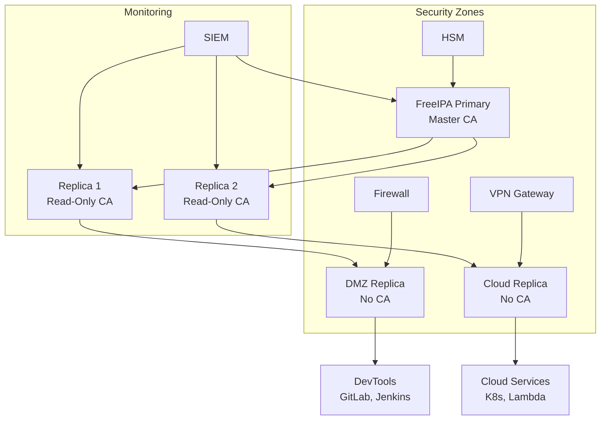

🔒 Категория: DevOps Essentials / Identity Management  
💡 Цель: Развернуть полнофункциональный FreeIPA сервер с LDAP, CA и DNS для централизованного управления идентификацией в DevOps инфраструктуре

🧠 Чему вы научитесь:

- Установка и настройка FreeIPA сервера на CentOS Stream 9
- Конфигурация встроенного LDAP, Certificate Authority и DNS
- Интеграция с DevOps инструментами (GitLab, Ansible)
- Управление пользователями и группами через CLI и Web UI
- Настройка SSL сертификатов и Kerberos аутентификации
- Мониторинг и troubleshooting FreeIPA сервисов
- Бэкап и восстановление конфигурации

⚠️ Критично перед стартом:

- CentOS Stream 9 (минимум 4GB RAM, 20GB диск)
- Статический IP адрес и настроенный FQDN
- Права sudo на сервере
- Открытые порты: 80, 443, 88, 464, 389, 636, 53
- Базовое понимание DNS и сертификатов

---

### 🏗️ Архитектура FreeIPA компонентов

# Архитектура компонентов FreeIPA

Полная архитектура FreeIPA разделена на логические блоки:

---

## 🗂️ Общая структура компонентов


graph TD
  Client["Linux Client"]
  Server["FreeIPA Server"]
  DevOps["DevOps Tools (GitLab, Ansible, Grafana)"]

  Client --> Server
  DevOps --> Server

  Server --> LDAP["LDAP Directory"]
  Server --> Kerberos["Kerberos KDC"]
  Server --> DNS["DNS Server"]
  Server --> CA["Certificate Authority"]
  Server --> WebAPI["Web API / UI"]


---

## 🔐 Аутентификация и доступ


flowchart LR
  Client[SSSD / PAM / autofs / ssh] -->|Auth| Kerberos[(Kerberos KDC)]
  Client -->|LDAP Bind| LDAP[(389 Directory Server)]
  Client -->|API / HTTPS| WebAPI[(IPA Web UI)]

  Kerberos -->|Tickets| Client
  LDAP -->|Directory Data| Client


---

## ⚙️ Интеграции с DevOps-инструментами


flowchart LR
  GitLab[GitLab]
  Ansible[Ansible]
  Grafana[Grafana]

  GitLab -->|LDAP| LDAP
  GitLab -->|Certs| CA
  Ansible -->|LDAP Lookup| LDAP
  Grafana -->|LDAP Auth| LDAP


---

## 🌐 Сетевые протоколы и порты


graph TD
  LDAP["LDAP Directory"] -->|TCP 389 / LDAPS 636| LDAP_Port["LDAP"]
  Kerberos["Kerberos KDC"] -->|TCP/UDP 88, 464| Kerberos_Port["Kerberos"]
  DNS["DNS Server"] -->|UDP/TCP 53| DNS_Port["DNS"]
  WebUI["Web Interface"] -->|TCP 443| HTTPS_Port["HTTPS"]


---


### 🚀 1. Подготовка системы

#### 🏷️ Настройка hostname и DNS

```bash
# Установка hostname (замените на ваш домен)
sudo hostnamectl set-hostname ipa.devops.local

# Проверка текущих настроек
hostnamectl status
```

#### 📝 Настройка /etc/hosts

```bash
# Редактируем hosts файл
sudo vi /etc/hosts

# Добавляем записи (замените IP на ваш)
192.168.1.100   ipa.devops.local ipa
127.0.0.1       localhost localhost.localdomain localhost4 localhost4.localdomain4
::1             localhost localhost.localdomain localhost6 localhost6.localdomain6
```

#### 🔄 Обновление системы

```bash
# Обновление пакетов
sudo dnf update -y

# Установка базовых утилит
sudo dnf install -y curl wget bind-utils net-tools htop vim tree \
    chrony policycoreutils-python-utils
```

#### 🔥 Настройка firewall

```bash
# Проверка статуса firewalld
sudo systemctl status firewalld
sudo systemctl enable firewalld --now

# Открываем порты FreeIPA
sudo firewall-cmd --permanent --add-service=freeipa-ldap
sudo firewall-cmd --permanent --add-service=freeipa-ldaps
sudo firewall-cmd --permanent --add-service=dns
sudo firewall-cmd --permanent --add-service=ntp
sudo firewall-cmd --permanent --add-service=http
sudo firewall-cmd --permanent --add-service=https
sudo firewall-cmd --permanent --add-service=kerberos
sudo firewall-cmd --permanent --add-service=kpasswd

# Альтернативно, открываем порты напрямую
sudo firewall-cmd --permanent --add-port=80/tcp
sudo firewall-cmd --permanent --add-port=443/tcp
sudo firewall-cmd --permanent --add-port=389/tcp
sudo firewall-cmd --permanent --add-port=636/tcp
sudo firewall-cmd --permanent --add-port=88/tcp
sudo firewall-cmd --permanent --add-port=88/udp
sudo firewall-cmd --permanent --add-port=464/tcp
sudo firewall-cmd --permanent --add-port=464/udp
sudo firewall-cmd --permanent --add-port=53/tcp
sudo firewall-cmd --permanent --add-port=53/udp
sudo firewall-cmd --permanent --add-port=123/udp

# Применяем правила
sudo firewall-cmd --reload

# Проверяем статус
sudo firewall-cmd --list-all
```

#### ⏰ Настройка времени (критично для Kerberos)

```bash
# Включаем и настраиваем chrony
sudo systemctl enable chronyd --now

# Конфигурируем NTP серверы
sudo tee /etc/chrony.conf << 'EOF'
# NTP серверы
pool 2.centos.pool.ntp.org iburst
server 0.centos.pool.ntp.org iburst
server 1.centos.pool.ntp.org iburst

# Позволяем быструю синхронизацию
makestep 1.0 3

# Логирование
logdir /var/log/chrony
EOF

# Перезапускаем chrony
sudo systemctl restart chronyd

# Проверяем синхронизацию
chrony sources -v
timedatectl status
```

#### 🔒 Настройка SELinux

```bash
# Проверяем статус SELinux
getenforce

# Если SELinux в режиме Enforcing, это нормально для FreeIPA
# Установка дополнительных SELinux политик
sudo dnf install -y policycoreutils-python-utils

# Настройка SELinux булевых для FreeIPA (будет сделано автоматически при установке)
sudo setsebool -P httpd_can_network_connect on
sudo setsebool -P httpd_can_connect_ldap on
```

---

### 📦 2. Установка FreeIPA

#### 📚 Установка пакетов FreeIPA

```bash
# Установка основных пакетов FreeIPA
sudo dnf install -y ipa-server ipa-server-dns ipa-client ipa-admintools

# Дополнительные утилиты
sudo dnf install -y openldap-clients krb5-workstation
```

#### 🎛️ Интерактивная установка FreeIPA

```bash
# Запуск мастера установки
sudo ipa-server-install --setup-dns

# Пример ответов на вопросы:
# Do you want to configure integrated DNS? [no]: yes
# Server host name [ipa.devops.local]: ipa.devops.local
# Please confirm the domain name [devops.local]: devops.local
# Please provide a realm name [DEVOPS.LOCAL]: DEVOPS.LOCAL
# Directory Manager password: [введите сложный пароль]
# IPA admin password: [введите сложный пароль]
# Do you want to configure DNS forwarders? [yes]: yes
# DNS forwarders: 8.8.8.8, 1.1.1.1
# Do you want to search for missing reverse zones? [yes]: yes
```

#### 🤖 Автоматизированная установка (скрипт)

```bash
# Создаем скрипт автоматической установки
cat > install-freeipa.sh << 'EOF'
#!/bin/bash

# Переменные конфигурации
HOSTNAME="ipa.devops.local"
DOMAIN="devops.local"
REALM="DEVOPS.LOCAL"
DM_PASSWORD="SuperSecretDMPass123!"
ADMIN_PASSWORD="SuperSecretAdminPass123!"
IP_ADDRESS=$(ip route get 8.8.8.8 | awk '{print $7; exit}')

echo "🚀 Начинаем установку FreeIPA на CentOS Stream 9..."
echo "📡 IP адрес сервера: $IP_ADDRESS"

# Проверка hostname
if [[ $(hostname -f) != "$HOSTNAME" ]]; then
    echo "❌ Hostname не совпадает! Текущий: $(hostname -f), ожидается: $HOSTNAME"
    exit 1
fi

# Проверка DNS
if ! nslookup $HOSTNAME > /dev/null 2>&1; then
    echo "⚠️  DNS разрешение не настроено, добавляем в /etc/hosts"
    echo "$IP_ADDRESS $HOSTNAME ${HOSTNAME%.*}" | sudo tee -a /etc/hosts
fi

# Установка FreeIPA
sudo ipa-server-install \
    --hostname="$HOSTNAME" \
    --domain="$DOMAIN" \
    --realm="$REALM" \
    --ds-password="$DM_PASSWORD" \
    --admin-password="$ADMIN_PASSWORD" \
    --setup-dns \
    --forwarder="8.8.8.8" \
    --forwarder="1.1.1.1" \
    --reverse-zone=$(echo $IP_ADDRESS | awk -F. '{print $3"."$2"."$1".in-addr.arpa."}') \
    --allow-zone-overlap \
    --unattended

if [ $? -eq 0 ]; then
    echo "✅ FreeIPA успешно установлен!"
    echo "🌐 Web UI: https://$HOSTNAME"
    echo "👤 Логин: admin"
    echo "🔑 Пароль: $ADMIN_PASSWORD"
    
    # Проверка сервисов
    echo "🔍 Проверка сервисов..."
    sudo ipactl status
    
    # Настройка автозапуска
    sudo systemctl enable ipa --now
    
else
    echo "❌ Ошибка установки FreeIPA"
    echo "📋 Проверьте логи: journalctl -u ipa-server-install"
    exit 1
fi
EOF

# Делаем скрипт исполняемым
chmod +x install-freeipa.sh

# Запускаем установку
./install-freeipa.sh
```

#### 🔧 Проверка установки

```bash
# Проверка всех сервисов FreeIPA
sudo ipactl status

# Получение Kerberos билета
kinit admin

# Проверка LDAP
ipa user-find

# Проверка DNS
nslookup ipa.devops.local

# Проверка веб-интерфейса
curl -k -I https://ipa.devops.local/ipa/ui/
```

---

### 🔧 3. Первоначальная настройка

#### 🎫 Аутентификация администратора

```bash
# Получение Kerberos билета
kinit admin
# Вводим пароль администратора

# Проверка билета
klist

# Ожидаемый вывод:
# Ticket cache: KEYRING:persistent:0:0
# Default principal: admin@DEVOPS.LOCAL
# Valid starting     Expires            Service principal
```

#### 🌐 Настройка DNS зон

```bash
# Проверка существующих зон
ipa dnszone-show devops.local

# Добавление дополнительных DNS записей
ipa dnsrecord-add devops.local gitlab --a-rec=192.168.1.102
ipa dnsrecord-add devops.local monitoring --a-rec=192.168.1.103
ipa dnsrecord-add devops.local ansible --a-rec=192.168.1.104

# Добавление CNAME записей
ipa dnsrecord-add devops.local www --cname-rec=ipa.devops.local.

# Проверка записей
ipa dnsrecord-find devops.local
```

#### 👥 Создание организационных единиц

```bash
# Создание групп для DevOps команд
ipa group-add devops-admins --desc="DevOps Administrators"
ipa group-add developers --desc="Development Team"
ipa group-add qa-team --desc="QA Testing Team"
ipa group-add monitoring-users --desc="Monitoring Access"
ipa group-add infrastructure --desc="Infrastructure Team"

# Создание пользователей
ipa user-add jdoe \
    --first=John \
    --last=Doe \
    --email=john.doe@devops.local \
    --shell=/bin/bash \
    --homedir=/home/jdoe \
    --password

ipa user-add jsmith \
    --first=Jane \
    --last=Smith \
    --email=jane.smith@devops.local \
    --shell=/bin/bash \
    --homedir=/home/jsmith \
    --password

# Добавление пользователей в группы
ipa group-add-member devops-admins --users=jdoe
ipa group-add-member developers --users=jsmith
```

#### 🤖 Настройка Service Accounts

```bash
# Создание service account для GitLab
ipa user-add gitlab-sa \
    --first=GitLab \
    --last=ServiceAccount \
    --email=gitlab@devops.local \
    --shell=/sbin/nologin \
    --password

# Создание service account для Grafana
ipa user-add grafana-sa \
    --first=Grafana \
    --last=ServiceAccount \
    --email=grafana@devops.local \
    --shell=/sbin/nologin \
    --password

# Создание service account для Ansible
ipa user-add ansible-sa \
    --first=Ansible \
    --last=ServiceAccount \
    --email=ansible@devops.local \
    --shell=/sbin/nologin \
    --password

# Создание группы для service accounts
ipa group-add service-accounts --desc="Service Accounts"
ipa group-add-member service-accounts --users=gitlab-sa,grafana-sa,ansible-sa
```

#### 🔐 Настройка sudo правил

```bash
# Создание sudo команд
ipa sudocmd-add --desc="All commands" /usr/bin/ALL

# Создание sudo правил для DevOps
ipa sudorule-add devops-sudo-all \
    --desc="DevOps administrators full sudo access"

# Добавление групп и команд к правилу
ipa sudorule-add-user devops-sudo-all --groups=devops-admins
ipa sudorule-add-host devops-sudo-all --hosts=ipa.devops.local
ipa sudorule-add-allow-command devops-sudo-all --sudocmds=/usr/bin/ALL

# Проверка правил
ipa sudorule-show devops-sudo-all
```

---

### 🔐 4. Настройка Certificate Authority

#### 📊 Проверка состояния CA

```bash
# Проверка статуса PKI
sudo systemctl status pki-tomcatd@pki-tomcat

# Проверка сертификатов
ipa cert-show 1

# Просмотр корневого сертификата
openssl x509 -in /etc/ipa/ca.crt -text -noout

# Проверка статуса CA через Web
curl -k https://ipa.devops.local:8443/ca/admin/ca/getStatus
```

#### 🎫 Создание сертификатов для сервисов

```bash
# Создание principal и сертификата для GitLab
ipa service-add HTTP/gitlab.devops.local
ipa-getcert request \
    -k /etc/pki/tls/private/gitlab.key \
    -f /etc/pki/tls/certs/gitlab.crt \
    -N CN=gitlab.devops.local \
    -D gitlab.devops.local \
    -K HTTP/gitlab.devops.local

# Создание principal и сертификата для Grafana
ipa service-add HTTP/monitoring.devops.local
ipa-getcert request \
    -k /etc/pki/tls/private/monitoring.key \
    -f /etc/pki/tls/certs/monitoring.crt \
    -N CN=monitoring.devops.local \
    -D monitoring.devops.local \
    -K HTTP/monitoring.devops.local

# Создание principal для Ansible
ipa service-add ansible/ansible.devops.local

# Проверка статуса запросов
ipa-getcert list

# Проверка сервисов
ipa service-find
```

#### 📤 Экспорт корневого сертификата

```bash
# Создание директории для экспорта
mkdir -p /tmp/freeipa-certs

# Экспорт CA сертификата
cp /etc/ipa/ca.crt /tmp/freeipa-certs/freeipa-ca.crt

# Конвертация в различные форматы
# PEM формат (уже готов)
cp /etc/ipa/ca.crt /tmp/freeipa-certs/freeipa-ca.pem

# DER формат
openssl x509 -in /etc/ipa/ca.crt -outform DER -out /tmp/freeipa-certs/freeipa-ca.der

# PKCS#12 формат для Windows
openssl pkcs12 -export -out /tmp/freeipa-certs/freeipa-ca.p12 \
    -nokeys -in /etc/ipa/ca.crt \
    -passout pass:freeipa123

# Создание bundle сертификатов
cat /etc/ipa/ca.crt > /tmp/freeipa-certs/ca-bundle.crt

echo "✅ Сертификаты экспортированы в /tmp/freeipa-certs/"
ls -la /tmp/freeipa-certs/
```

---

### 🌐 5. Интеграция с DevOps инструментами

#### 🦊 GitLab интеграция

```yaml
# Конфигурация GitLab LDAP в /etc/gitlab/gitlab.rb
gitlab_rails['ldap_enabled'] = true
gitlab_rails['prevent_ldap_sign_in'] = false
gitlab_rails['ldap_servers'] = {
  'main' => {
    'label' => 'FreeIPA LDAP',
    'host' =>  'ipa.devops.local',
    'port' => 636,
    'uid' => 'uid',
    'encryption' => 'simple_tls',
    'verify_certificates' => true,
    'ca_file' => '/etc/ssl/certs/freeipa-ca.pem',
    'bind_dn' => 'uid=gitlab-sa,cn=users,cn=accounts,dc=devops,dc=local',
    'password' => 'gitlab-sa-password',
    'base' => 'cn=users,cn=accounts,dc=devops,dc=local',
    'user_filter' => '',
    'attributes' => {
      'username' => ['uid'],
      'email' => ['mail'],
      'name' => ['displayName'],
      'first_name' => ['givenName'],
      'last_name' => ['sn']
    },
    'group_base' => 'cn=groups,cn=accounts,dc=devops,dc=local',
    'admin_group' => 'devops-admins',
    'sync_ssh_keys' => 'sshPublicKey'
  }
}

# Настройка SSL сертификата
gitlab_rails['gitlab_https'] = true
gitlab_rails['gitlab_ssl_certificate'] = "/etc/pki/tls/certs/gitlab.crt"
gitlab_rails['gitlab_ssl_certificate_key'] = "/etc/pki/tls/private/gitlab.key"
```

#### 🤖 Ansible интеграция

```yaml
# Ansible inventory с FreeIPA LDAP
# inventory/group_vars/all.yml
ldap_server: ipa.devops.local
ldap_port: 636
ldap_base_dn: dc=devops,dc=local
ldap_bind_dn: uid=ansible-sa,cn=users,cn=accounts,dc=devops,dc=local
ldap_bind_password: "{{ vault_ldap_password }}"
ldap_ca_cert: /etc/ssl/certs/freeipa-ca.pem

# Playbook для проверки LDAP подключения
---
- name: Test FreeIPA LDAP connection
  hosts: localhost
  become: false
  vars:
    ansible_python_interpreter: /usr/bin/python3
  tasks:
    - name: Install python-ldap
      pip:
        name: python-ldap
        state: present
        
    - name: Search LDAP users
      community.general.ldap_search:
        server_uri: ldaps://{{ ldap_server }}:{{ ldap_port }}
        bind_dn: "{{ ldap_bind_dn }}"
        bind_pw: "{{ ldap_bind_password }}"
        dn: "cn=users,cn=accounts,{{ ldap_base_dn }}"
        scope: onelevel
        filter: "(objectClass=inetOrgPerson)"
        ca_certs_file: "{{ ldap_ca_cert }}"
      register: ldap_users
      
    - name: Display users
      debug:
        msg: "Found {{ ldap_users.results | length }} users"
        
    - name: Show user details
      debug:
        msg: "User: {{ item.uid[0] }}, Email: {{ item.mail[0] | default('N/A') }}"
      loop: "{{ ldap_users.results }}"
      when: ldap_users.results is defined
```

#### 📊 Grafana интеграция

```ini
# Конфигурация Grafana LDAP в /etc/grafana/ldap.toml
[[servers]]
host = "ipa.devops.local"
port = 636
use_ssl = true
start_tls = false
ssl_skip_verify = false
root_ca_cert = "/etc/ssl/certs/freeipa-ca.pem"
client_cert = ""
client_key = ""

bind_dn = "uid=grafana-sa,cn=users,cn=accounts,dc=devops,dc=local"
bind_password = "grafana-sa-password"

timeout = 10
search_filter = "(uid=%s)"
search_base_dns = ["cn=users,cn=accounts,dc=devops,dc=local"]

[servers.attributes]
name = "displayName"
surname = "sn"
username = "uid"
member_of = "memberOf"
email = "mail"

[[servers.group_mappings]]
group_dn = "cn=devops-admins,cn=groups,cn=accounts,dc=devops,dc=local"
org_role = "Admin"
grafana_admin = true

[[servers.group_mappings]]
group_dn = "cn=developers,cn=groups,cn=accounts,dc=devops,dc=local"
org_role = "Editor"

[[servers.group_mappings]]
group_dn = "cn=monitoring-users,cn=groups,cn=accounts,dc=devops,dc=local"
org_role = "Viewer"
```

#### 🐳 Jenkins интеграция

```groovy
// Jenkins LDAP configuration (в Jenkins UI или как код)
jenkins:
  securityRealm:
    ldap:
      configurations:
        - server: "ldaps://ipa.devops.local:636"
          rootDN: "dc=devops,dc=local"
          userSearchBase: "cn=users,cn=accounts"
          userSearch: "uid={0}"
          groupSearchBase: "cn=groups,cn=accounts"
          groupSearchFilter: "member={0}"
          managerDN: "uid=jenkins-sa,cn=users,cn=accounts,dc=devops,dc=local"
          managerPasswordSecret: "jenkins-ldap-password"
          displayNameAttributeName: "displayName"
          mailAddressAttributeName: "mail"
```

---

### 🔍 6. Мониторинг и диагностика

#### 📊 Мониторинг сервисов FreeIPA

```bash
# Скрипт мониторинга всех сервисов
cat > freeipa-monitor.sh << 'EOF'
#!/bin/bash

echo "🔍 FreeIPA Services Status Check - CentOS Stream 9"
echo "=================================================="

# Проверка основных сервисов
services=(
    "ipa"
    "krb5kdc"
    "kadmin" 
    "named"
    "httpd"
    "pki-tomcatd@pki-tomcat"
    "dirsrv@DEVOPS-LOCAL"
    "chronyd"
)

for service in "${services[@]}"; do
    if systemctl is-active --quiet "$service"; then
        echo "✅ $service - Running"
    else
        echo "❌ $service - Stopped"
    fi
done

echo ""
echo "🌐 Web Interface Test:"
curl -k -s -o /dev/null -w "HTTP Status: %{http_code}\n" \
    https://ipa.devops.local/ipa/ui/

echo ""
echo "🔐 LDAP Connection Test:"
ldapsearch -x -H ldaps://ipa.devops.local:636 \
    -D "cn=Directory Manager" \
    -W -b "dc=devops,dc=local" \
    "(objectClass=*)" dn 2>/dev/null | head -5

echo ""
echo "📊 Certificate Status:"
ipa-getcert list | grep -E "(Request ID|status:|stuck:"

echo ""
echo "⏰ Time Synchronization:"
chrony sources

echo ""
echo "🔥 Firewall Status:"
firewall-cmd --list-services

echo ""
echo "💾 Disk Usage:"
df -h /var/lib/dirsrv/ /var/log/

echo ""
echo "🧠 Memory Usage:"
free -h

echo ""
echo "📈 IPA Services Overview:"
sudo ipactl status
EOF

chmod +x freeipa-monitor.sh
./freeipa-monitor.sh
```

#### 📝 Настройка расширенного логирования

```bash
# Настройка rsyslog для FreeIPA
sudo tee /etc/rsyslog.d/10-freeipa.conf << 'EOF'
# FreeIPA centralized logging
$ModLoad imudp
$UDPServerRun 514

# FreeIPA specific logging
local1.*    /var/log/freeipa/krb5kdc.log
local2.*    /var/log/freeipa/kadmin.log
local3.*    /var/log/freeipa/named.log
local4.*    /var/log/freeipa/httpd.log
local5.*    /var/log/freeipa/dirsrv.log
local6.*    /var/log/freeipa/pki.log

# Rotate logs daily
$WorkDirectory /var/spool/rsyslog
$ActionFileDefaultTemplate RSYSLOG_TraditionalFileFormat
EOF

# Создание директории для логов
sudo mkdir -p /var/log/freeipa
sudo chown root:root /var/log/freeipa
sudo chmod 755 /var/log/freeipa

# Настройка logrotate
sudo tee /etc/logrotate.d/freeipa << 'EOF'
/var/log/freeipa/*.log {
    daily
    rotate 30
    compress
    delaycompress
    missingok
    notifempty
    create 644 root root
    postrotate
        /bin/kill -HUP `cat /var/run/rsyslogd.pid 2> /dev/null` 2> /dev/null || true
    endscript
}
EOF

# Перезапуск rsyslog
sudo systemctl restart rsyslog
```

#### 🔧 Расширенный скрипт диагностики

```bash
cat > freeipa-troubleshoot.sh << 'EOF'
#!/bin/bash

echo "🔧 FreeIPA Comprehensive Troubleshooting Script"
echo "==============================================="

# Переменные
IPA_DOMAIN="devops.local"
IPA_SERVER="ipa.devops.local"

echo "1. 🌐 DNS Resolution Test:"
nslookup $IPA_SERVER
dig $IPA_SERVER A
dig $IPA_DOMAIN MX
echo ""

echo "2. 🎫 Kerberos Configuration:"
klist -k /etc/krb5.keytab | head -10
echo ""
echo "Kerberos config file:"
grep -v "^#" /etc/krb5.conf | grep -v "^$"
echo ""

echo "3. 📜 Certificate Validity:"
openssl x509 -in /etc/httpd/alias/server.crt -noout -dates 2>/dev/null || \
    echo "HTTP certificate not found"
openssl x509 -in /etc/ipa/ca.crt -noout -dates 2>/dev/null || \
    echo "CA certificate not found"
echo ""

echo "4. 📡 LDAP Connectivity:"
ldapsearch -x -H ldap://localhost:389 -s base -b "" namingContexts
echo ""

echo "5. 💽 Disk Space Check:"
df -h /var/lib/dirsrv/ /var/log/ /tmp/
echo ""

echo "6. 🔌 Port Availability:"
ss -tlnp | grep -E ":80|:443|:389|:636|:88|:464|:53"
echo ""

echo "7. ⏰ Time Synchronization:"
timedatectl status
chrony sources -v
echo ""

echo "8. 🔒 SELinux Status:"
getenforce
ausearch -m avc -ts recent 2>/dev/null | tail -5
echo ""

echo "9. 🔥 Firewall Rules:"
firewall-cmd --list-all
echo ""

echo "10. 📊 Service Status Details:"
sudo ipactl status
systemctl is-failed ipa krb5kdc kadmin named httpd dirsrv@DEVOPS-LOCAL pki-tomcatd@pki-tomcat
echo ""

echo "11. 📋 Recent Log Errors:"
echo "=== HTTPD Errors ==="
tail -5 /var/log/httpd/error_log 2>/dev/null || echo "No httpd error log"
echo ""
echo "=== Directory Server Errors ==="
tail -5 /var/log/dirsrv/slapd-DEVOPS-LOCAL/errors 2>/dev/null || echo "No DS error log"
echo ""
echo "=== Kerberos Errors ==="
tail -5 /var/log/krb5kdc.log 2>/dev/null || echo "No KDC error log"
echo ""

echo "12. 🧠 Memory and Load:"
free -h
uptime
echo ""

echo "🔧 Troubleshooting completed. Check the output above for issues."
EOF

chmod +x freeipa-troubleshoot.sh
```

#### 📊 Настройка мониторинга через Prometheus

```bash
# Создание экспортера метрик FreeIPA
cat > freeipa-exporter.py << 'EOF'
#!/usr/bin/env python3
"""
FreeIPA Prometheus Exporter
Экспортирует метрики FreeIPA для мониторинга
"""

import subprocess
import time
import json
from http.server import HTTPServer, BaseHTTPRequestHandler

class MetricsHandler(BaseHTTPRequestHandler):
    def do_GET(self):
        if self.path == '/metrics':
            metrics = self.collect_metrics()
            self.send_response(200)
            self.send_header('Content-type', 'text/plain')
            self.end_headers()
            self.wfile.write(metrics.encode())
        else:
            self.send_response(404)
            self.end_headers()

    def collect_metrics(self):
        metrics = []
        
        # Проверка сервисов
        services = [
            'ipa', 'krb5kdc', 'kadmin', 'named', 
            'httpd', 'dirsrv@DEVOPS-LOCAL', 'pki-tomcatd@pki-tomcat'
        ]
        
        for service in services:
            try:
                result = subprocess.run(
                    ['systemctl', 'is-active', service],
                    capture_output=True, text=True
                )
                status = 1 if result.stdout.strip() == 'active' else 0
                metrics.append(f'freeipa_service_status{{service="{service}"}} {status}')
            except:
                metrics.append(f'freeipa_service_status{{service="{service}"}} 0')
        
        # Количество пользователей
        try:
            result = subprocess.run(
                ['ipa', 'user-find', '--raw', '--no-members'],
                capture_output=True, text=True
            )
            user_count = result.stdout.count('uid:')
            metrics.append(f'freeipa_users_total {user_count}')
        except:
            metrics.append('freeipa_users_total 0')
        
        # Количество групп
        try:
            result = subprocess.run(
                ['ipa', 'group-find', '--raw'],
                capture_output=True, text=True
            )
            group_count = result.stdout.count('cn:')
            metrics.append(f'freeipa_groups_total {group_count}')
        except:
            metrics.append('freeipa_groups_total 0')
        
        # Статус сертификатов
        try:
            result = subprocess.run(
                ['ipa-getcert', 'list'],
                capture_output=True, text=True
            )
            cert_monitoring = result.stdout.count('status: MONITORING')
            cert_error = result.stdout.count('status: CA_UNREACHABLE')
            metrics.append(f'freeipa_certificates_monitoring {cert_monitoring}')
            metrics.append(f'freeipa_certificates_error {cert_error}')
        except:
            metrics.append('freeipa_certificates_monitoring 0')
            metrics.append('freeipa_certificates_error 0')
        
        return '\n'.join(metrics) + '\n'

if __name__ == '__main__':
    server = HTTPServer(('0.0.0.0', 9393), MetricsHandler)
    print("FreeIPA Prometheus Exporter running on port 9393")
    server.serve_forever()
EOF

chmod +x freeipa-exporter.py

# Создание systemd сервиса для экспортера
sudo tee /etc/systemd/system/freeipa-exporter.service << 'EOF'
[Unit]
Description=FreeIPA Prometheus Exporter
After=network.target ipa.service

[Service]
Type=simple
User=root
ExecStart=/usr/local/bin/freeipa-exporter.py
Restart=always
RestartSec=10

[Install]
WantedBy=multi-user.target
EOF

# Установка и запуск
sudo cp freeipa-exporter.py /usr/local/bin/
sudo systemctl daemon-reload
sudo systemctl enable freeipa-exporter --now

# Открытие порта в firewall
sudo firewall-cmd --permanent --add-port=9393/tcp
sudo firewall-cmd --reload

echo "✅ FreeIPA Prometheus Exporter установлен и запущен на порту 9393"
```

---

### 🚨 Типичные ошибки и решения

#### 1. **Ошибка DNS разрешения имен**

**Проблема:** `unable to resolve host ipa.devops.local`

```bash
# Диагностика
nslookup ipa.devops.local
dig ipa.devops.local

# 🔴 Решение 1: Проверка /etc/hosts
sudo vi /etc/hosts
# Убедитесь что есть запись:
192.168.1.100   ipa.devops.local ipa

# 🟢 Решение 2: Проверка DNS сервера
sudo systemctl status named
sudo journalctl -u named -f

# Решение 3: Перезапуск DNS и проверка зон
sudo systemctl restart named
ipa dnszone-find
ipa dnsrecord-find devops.local

# Решение 4: Проверка NetworkManager DNS
sudo nmcli connection show
sudo nmcli connection modify "System eth0" ipv4.dns "127.0.0.1,8.8.8.8"
sudo nmcli connection up "System eth0"
```

#### 2. **Ошибка "Clock skew too great"**

**Проблема:** Проблемы с синхронизацией времени

```bash
# Диагностика
timedatectl status
chrony sources -v

# Решение: Принудительная синхронизация
sudo chrony makestep
sudo systemctl restart chronyd

# Проверка и настройка chrony
sudo tee -a /etc/chrony.conf << 'EOF'
# Разрешить большие коррекции времени
makestep 1.0 3
# Более частая синхронизация
maxupdateskew 100.0
EOF

sudo systemctl restart chronyd
```

#### 3. **Directory Server не запускается**

**Проблема:** `dirsrv@DEVOPS-LOCAL.service failed`

```bash
# Диагностика
sudo systemctl status dirsrv@DEVOPS-LOCAL
sudo journalctl -u dirsrv@DEVOPS-LOCAL -n 50

# Решение 1: Проверка прав доступа
sudo chown -R dirsrv:dirsrv /var/lib/dirsrv/
sudo restorecon -R /var/lib/dirsrv/

# Решение 2: Проверка дискового пространства
df -h /var/lib/dirsrv/
sudo du -sh /var/lib/dirsrv/slapd-DEVOPS-LOCAL/

# Решение 3: Проверка базы данных
sudo -u dirsrv /usr/sbin/ns-slapd -D /etc/dirsrv/slapd-DEVOPS-LOCAL -d 1

# Решение 4: Восстановление из backup
sudo dsconf -D "cn=Directory Manager" ldap://localhost:389 backup list
sudo dsconf -D "cn=Directory Manager" ldap://localhost:389 backup restore /path/to/backup
```

#### 4. **PKI/CA проблемы**

**Проблема:** `pki-tomcatd@pki-tomcat.service failed`

```bash
# Диагностика
sudo systemctl status pki-tomcatd@pki-tomcat
sudo journalctl -u pki-tomcatd@pki-tomcat -n 50

# Проверка логов PKI
sudo tail -f /var/log/pki/pki-tomcat/ca/debug.*

# Решение 1: Проверка Java процессов
sudo ps aux | grep tomcat
sudo netstat -tlnp | grep :8080

# Решение 2: Очистка временных файлов
sudo systemctl stop pki-tomcatd@pki-tomcat
sudo rm -rf /var/lib/pki/pki-tomcat/temp/*
sudo rm -rf /var/lib/pki/pki-tomcat/work/*
sudo systemctl start pki-tomcatd@pki-tomcat

# Решение 3: Проверка сертификатов PKI
sudo certutil -L -d /etc/pki/pki-tomcat/alias/
```

#### 5. **Web UI недоступен (HTTP 500)**

**Проблема:** Ошибка 500 при доступе к веб-интерфейсу

```bash
# Диагностика
sudo systemctl status httpd
sudo tail -f /var/log/httpd/error_log

# Решение 1: Проверка конфигурации Apache
sudo httpd -t
sudo apachectl configtest

# Решение 2: Проверка SELinux контекстов
sudo restorecon -R /etc/httpd/
sudo setsebool -P httpd_can_network_connect on
sudo setsebool -P httpd_can_connect_ldap on

# Решение 3: Проверка mod_wsgi
sudo dnf install -y python3-mod_wsgi
sudo systemctl restart httpd

# Решение 4: Проверка прав доступа
sudo chown -R apache:apache /var/log/httpd/
sudo chmod -R 755 /etc/httpd/conf.d/
```

#### 6. **Kerberos аутентификация не работает**

**Проблема:** `kinit: KDC reply did not match expectations`

```bash
# Диагностика
klist
sudo systemctl status krb5kdc

# Решение 1: Очистка билетов и повторная аутентификация
kdestroy
kinit admin

# Решение 2: Проверка keytab
sudo klist -k /etc/krb5.keytab
sudo ktutil
# В ktutil: rkt /etc/krb5.keytab
# В ktutil: list

# Решение 3: Проверка конфигурации Kerberos
sudo cat /etc/krb5.conf | grep -v "^#" | grep -v "^$"

# Решение 4: Регенерация keytab
sudo ipa-getkeytab -s ipa.devops.local -p host/ipa.devops.local -k /etc/krb5.keytab

# Решение 5: Синхронизация времени (критично!)
sudo chrony makestep
sudo chronyc sources -v
```

#### 7. **LDAP SSL/TLS проблемы**

**Проблема:** SSL certificate verification failed

```bash
# Диагностика
openssl s_client -connect ipa.devops.local:636 -verify_return_error

# Решение 1: Установка CA сертификата
sudo cp /etc/ipa/ca.crt /etc/pki/ca-trust/source/anchors/freeipa-ca.crt
sudo update-ca-trust

# Решение 2: Проверка SSL сертификата LDAP
sudo certutil -L -d /etc/dirsrv/slapd-DEVOPS-LOCAL/

# Решение 3: Обновление сертификата
ipa-getcert list
ipa-getcert resubmit -i <request-id>

# Решение 4: Тест LDAP подключения
ldapsearch -x -H ldaps://ipa.devops.local:636 -D "uid=admin,cn=users,cn=accounts,dc=devops,dc=local" -W -b "dc=devops,dc=local" "(objectClass=*)"
```

---

### 🧪 Расширенный чеклист самопроверки

#### ✅ Системные требования

- [ ] CentOS Stream 9 установлен и обновлен
- [ ] Минимум 4GB RAM доступно (8GB рекомендуется)
- [ ] 20GB свободного места на диске
- [ ] Статический IP адрес настроен
- [ ] FQDN корректно настроен (`hostname -f`)
- [ ] Firewall правила настроены (firewalld)
- [ ] NTP/Chrony синхронизация работает
- [ ] DNS резолвинг работает
- [ ] SELinux в режиме Enforcing (рекомендуется)

#### ✅ FreeIPA установка

- [ ] Все пакеты FreeIPA установлены через dnf
- [ ] Установка завершилась без ошибок
- [ ] Web UI доступен (https://ipa.devops.local)
- [ ] Directory Server запущен и работает
- [ ] Kerberos KDC функционирует
- [ ] DNS сервер отвечает на запросы
- [ ] Certificate Authority выдает сертификаты
- [ ] `ipactl status` показывает все сервисы активными

#### ✅ Аутентификация и авторизация

- [ ] `kinit admin` работает без ошибок
- [ ] LDAP поиск возвращает корректные результаты
- [ ] Пользователи создаются и изменяются успешно
- [ ] Группы назначаются корректно
- [ ] Service accounts настроены и функционируют
- [ ] SSL сертификаты выпускаются автоматически
- [ ] Sudo правила работают на клиентах

#### ✅ Интеграция с DevOps инструментами

- [ ] GitLab успешно интегрирован с LDAP
- [ ] Ansible использует FreeIPA для authentication
- [ ] Grafana подключен к LDAP FreeIPA
- [ ] Jenkins аутентификация через LDAP работает
- [ ] SSH ключи синхронизируются из FreeIPA
- [ ] Сертификаты автоматически распространяются

#### ✅ Мониторинг и обслуживание

- [ ] Скрипты мониторинга настроены и запущены
- [ ] Prometheus экспортер работает
- [ ] Логирование настроено и ротируется
- [ ] Backup процедуры настроены и тестированы
- [ ] Troubleshooting скрипты готовы к использованию
- [ ] Документация обновлена и актуальна

#### ✅ Безопасность и производительность

- [ ] SELinux политики корректно настроены
- [ ] Firewall правила минимально необходимые
- [ ] SSL/TLS везде где возможно
- [ ] Регулярная ротация паролей настроена
- [ ] Аудит логов настроен
- [ ] Мониторинг производительности активен

---

### 🔄 7. Бэкап и восстановление

#### 📦 Настройка автоматического бэкапа

```bash
# Создание скрипта бэкапа
cat > /usr/local/bin/freeipa-backup.sh << 'EOF'
#!/bin/bash

BACKUP_DIR="/backup/freeipa"
RETENTION_DAYS=30
DATE=$(date +%Y%m%d_%H%M%S)

# Создание директории для бэкапов
mkdir -p $BACKUP_DIR

echo "🔄 Starting FreeIPA backup: $DATE"

# Бэкап FreeIPA
ipa-backup --data --logs --dir=$BACKUP_DIR

if [ $? -eq 0 ]; then
    echo "✅ FreeIPA backup completed successfully"
    
    # Компрессия бэкапа
    cd $BACKUP_DIR
    latest_backup=$(ls -t | head -1)
    tar -czf "${latest_backup}_${DATE}.tar.gz" "$latest_backup"
    rm -rf "$latest_backup"
    
    # Очистка старых бэкапов
    find $BACKUP_DIR -name "*.tar.gz" -mtime +$RETENTION_DAYS -delete
    
    echo "📊 Backup size: $(du -sh ${latest_backup}_${DATE}.tar.gz)"
else
    echo "❌ FreeIPA backup failed"
    exit 1
fi
EOF

chmod +x /usr/local/bin/freeipa-backup.sh

# Настройка cron для автоматического бэкапа
sudo tee /etc/cron.d/freeipa-backup << 'EOF'
# FreeIPA automatic backup - every day at 2 AM
0 2 * * * root /usr/local/bin/freeipa-backup.sh >> /var/log/freeipa-backup.log 2>&1
EOF

# Создание директории для бэкапов
sudo mkdir -p /backup/freeipa
sudo chown root:root /backup/freeipa
sudo chmod 700 /backup/freeipa
```

#### 🔄 Процедура восстановления

```bash
# Скрипт восстановления FreeIPA
cat > /usr/local/bin/freeipa-restore.sh << 'EOF'
#!/bin/bash

BACKUP_DIR="/backup/freeipa"

if [ $# -eq 0 ]; then
    echo "❌ Usage: $0 <backup_file.tar.gz>"
    echo "Available backups:"
    ls -la $BACKUP_DIR/*.tar.gz
    exit 1
fi

BACKUP_FILE="$1"

if [ ! -f "$BACKUP_FILE" ]; then
    echo "❌ Backup file not found: $BACKUP_FILE"
    exit 1
fi

echo "⚠️  WARNING: This will restore FreeIPA from backup!"
echo "Backup file: $BACKUP_FILE"
read -p "Continue? (yes/no): " confirm

if [ "$confirm" != "yes" ]; then
    echo "Restore cancelled"
    exit 0
fi

# Остановка сервисов
echo "🛑 Stopping FreeIPA services..."
sudo ipactl stop

# Извлечение бэкапа
cd $BACKUP_DIR
tar -xzf "$BACKUP_FILE"
backup_dir=$(basename "$BACKUP_FILE" .tar.gz | sed 's/_[0-9]*_[0-9]*$//')

# Восстановление
echo "🔄 Restoring FreeIPA..."
ipa-restore "$backup_dir"

if [ $? -eq 0 ]; then
    echo "✅ FreeIPA restore completed successfully"
    echo "🚀 Starting services..."
    sudo ipactl start
else
    echo "❌ FreeIPA restore failed"
    exit 1
fi
EOF

chmod +x /usr/local/bin/freeipa-restore.sh
```

---

### 🧠 Итоги и best practices

🔑 **Ключевые принципы для production:**

- **Используйте CentOS Stream 9** или RHEL 9 для стабильной работы FreeIPA
- **Обязательная синхронизация времени** - настройте NTP/Chrony
- **Мониторинг критичен** - используйте Prometheus + Grafana
- **Регулярные бэкапы** - автоматизируйте с помощью cron
- **SELinux в Enforcing** - не отключайте для безопасности
- **SSL везде** - используйте встроенный CA для всех сервисов

✅ **Финальная проверка готовности:**

```bash
# Комплексный тест функциональности
echo "🧪 Final FreeIPA readiness test"

# 1. Kerberos authentication
kinit admin && echo "✅ Kerberos OK" || echo "❌ Kerberos FAIL"

# 2. LDAP search
ipa user-find --all > /dev/null && echo "✅ LDAP OK" || echo "❌ LDAP FAIL"

# 3. Certificate management
ipa-getcert list > /dev/null && echo "✅ Certificates OK" || echo "❌ Certificates FAIL"

# 4. DNS resolution
nslookup ipa.devops.local > /dev/null && echo "✅ DNS OK" || echo "❌ DNS FAIL"

# 5. Web interface
curl -k -I https://ipa.devops.local/ipa/ui/ | grep -q "200 OK" && echo "✅ Web UI OK" || echo "❌ Web UI FAIL"

# 6. Service status
sudo ipactl status | grep -q "RUNNING" && echo "✅ Services OK" || echo "❌ Services FAIL"
```

💬 **Ваш следующий шаг:** Настройте клиентские машины для подключения к FreeIPA:

```bash
# На клиентской машине CentOS/RHEL
sudo dnf install -y ipa-client
sudo ipa-client-install --domain=devops.local --server=ipa.devops.local --mkhomedir
```

---

### 🆘 Быстрая помощь

**Если что-то пошло не так:**

1. `./freeipa-troubleshoot.sh` — комплексная диагностика
2. `sudo ipactl status` — проверка всех сервисов FreeIPA
3. `sudo journalctl -u ipa -f` — логи в реальном времени
4. `ipa-getcert list` — состояние сертификатов

**Критичные команды для запоминания:**

```bash
kinit admin                           # Получение Kerberos билета
ipa user-find                         # Поиск пользователей
ipa-getcert list                      # Список сертификатов
sudo ipactl restart                   # Перезапуск всех сервисов FreeIPA
sudo firewall-cmd --list-all          # Проверка firewall правил
chrony sources -v                     # Статус синхронизации времени
```

🎯 **Pro Tips:**
- Всегда тестируйте на dev окружении перед production
- Держите документацию актуальной
- Мониторьте логи регулярно
- Делайте бэкапы перед любыми изменениями

---

### ⚠️ Риски и ограничения

#### 🚨 Критичность компонентов

**Single Point of Failure без репликации:**
```bash
# Критические риски одного сервера
echo "⚠️ Production FreeIPA ДОЛЖЕН иметь реплики!"

# Проверка текущей конфигурации
ipa topologysegment-find realm

# Минимальная HA архитектура:
# 1 Master + 2 Replica серверах
# Geographic distribution реплик
# Автоматический failover DNS
```

**Временная синхронизация (критично для Kerberos):**
```bash
# Мониторинг временной погрешности
cat > /usr/local/bin/time-drift-monitor.sh << 'EOF'
#!/bin/bash
THRESHOLD=300  # 5 минут в секундах
CURRENT_DRIFT=$(chrony sources -v | grep "^\^" | awk '{print $9}' | sed 's/[^0-9.-]//g' | head -1)

if [ $(echo "$CURRENT_DRIFT > $THRESHOLD" | bc) -eq 1 ]; then
    echo "❌ CRITICAL: Time drift ${CURRENT_DRIFT}s exceeds threshold!"
    # Уведомления в Slack/Teams
    curl -X POST -H 'Content-type: application/json' \
        --data '{"text":"🚨 FreeIPA Time Drift Alert: '${CURRENT_DRIFT}'s"}' \
        $SLACK_WEBHOOK_URL
    exit 1
fi
EOF

chmod +x /usr/local/bin/time-drift-monitor.sh

# Cron каждые 5 минут
echo "*/5 * * * * root /usr/local/bin/time-drift-monitor.sh" >> /etc/cron.d/time-monitor
```

**Ресурсные требования:**
```bash
# Скрипт проверки минимальных требований
cat > check-resources.sh << 'EOF'
#!/bin/bash
echo "🔍 FreeIPA Resource Requirements Check"

# RAM check (минимум 4GB)
RAM_MB=$(free -m | awk '/^Mem:/{print $2}')
if [ $RAM_MB -lt 4096 ]; then
    echo "❌ RAM: ${RAM_MB}MB < 4096MB required"
else
    echo "✅ RAM: ${RAM_MB}MB OK"
fi

# Disk space check (минимум 20GB)
DISK_GB=$(df -BG /var/lib/dirsrv/ | awk 'NR==2{print $4}' | sed 's/G//')
if [ $DISK_GB -lt 20 ]; then
    echo "❌ Disk: ${DISK_GB}GB < 20GB required"
else
    echo "✅ Disk: ${DISK_GB}GB OK"
fi

# CPU cores (рекомендуется 4+)
CPU_CORES=$(nproc)
if [ $CPU_CORES -lt 4 ]; then
    echo "⚠️ CPU: ${CPU_CORES} cores (4+ recommended)"
else
    echo "✅ CPU: ${CPU_CORES} cores OK"
fi
EOF
```

#### 🔧 Сложность интеграции

**SELinux политики (расширенная настройка):**
```bash
# Создание кастомных SELinux политик для FreeIPA
cat > freeipa-custom.te << 'EOF'
module freeipa-custom 1.0;

require {
    type httpd_t;
    type dirsrv_t;
    type krb5kdc_t;
    class tcp_socket { name_bind };
    class capability { dac_override };
}

# Разрешить httpd подключение к нестандартным портам
allow httpd_t self:tcp_socket name_bind;

# Разрешить dirsrv дополнительные привилегии
allow dirsrv_t self:capability dac_override;
EOF

# Компиляция и установка политики
checkmodule -M -m -o freeipa-custom.mod freeipa-custom.te
semodule_package -o freeipa-custom.pp -m freeipa-custom.mod
sudo semodule -i freeipa-custom.pp

# Проверка SELinux denial
sudo ausearch -m avc -ts recent | grep -i freeipa
```

**Reverse DNS зоны (автоматическая настройка):**
```bash
# Автоматическое создание reverse DNS зон
cat > setup-reverse-dns.sh << 'EOF'
#!/bin/bash
NETWORK="192.168.1"
REVERSE_ZONE="${NETWORK#*.}.${NETWORK%%.*}.in-addr.arpa."

echo "🌐 Creating reverse DNS zone: $REVERSE_ZONE"

# Создание reverse зоны
ipa dnszone-add $REVERSE_ZONE --name-server=ipa.devops.local. \
    --admin-email=hostmaster.devops.local

# Добавление PTR записей для основных хостов
ipa dnsrecord-add $REVERSE_ZONE 100 --ptr-rec=ipa.devops.local.
ipa dnsrecord-add $REVERSE_ZONE 102 --ptr-rec=gitlab.devops.local.
ipa dnsrecord-add $REVERSE_ZONE 103 --ptr-rec=monitoring.devops.local.

echo "✅ Reverse DNS zone configured"
EOF
```

**SAN сертификаты (расширенная конфигурация):**
```bash
# Создание сертификатов с множественными SAN
ipa service-add HTTP/gitlab.devops.local
ipa-getcert request \
    -k /etc/pki/tls/private/gitlab-multi.key \
    -f /etc/pki/tls/certs/gitlab-multi.crt \
    -N CN=gitlab.devops.local \
    -D gitlab.devops.local \
    -D git.devops.local \
    -D ci.devops.local \
    -K HTTP/gitlab.devops.local

# Проверка SAN в сертификате
openssl x509 -in /etc/pki/tls/certs/gitlab-multi.crt -text -noout | grep -A1 "Subject Alternative Name"
```

#### 🔒 Безопасность

**Защита от Golden Ticket атак:**
```bash
# Настройка детекции Golden Ticket атак
cat > /etc/rsyslog.d/15-kerberos-security.conf << 'EOF'
# Kerberos security monitoring
:msg, contains, "TGS_REQ" /var/log/kerberos-security.log
:msg, contains, "AS_REQ" /var/log/kerberos-security.log
:msg, contains, "FAILED" /var/log/kerberos-security.log
& stop
EOF

# SIEM интеграция для анализа Kerberos логов
cat > kerberos-anomaly-detection.py << 'EOF'
#!/usr/bin/env python3
import re
import json
from datetime import datetime, timedelta

def detect_golden_ticket_indicators():
    indicators = [
        "unusual TGT lifetime",
        "TGT for krbtgt account",
        "multiple TGT requests from same IP",
        "TGT requests outside business hours"
    ]
    
    with open('/var/log/kerberos-security.log') as f:
        logs = f.readlines()
    
    alerts = []
    for line in logs:
        for indicator in indicators:
            if indicator.lower() in line.lower():
                alerts.append({
                    'timestamp': datetime.now().isoformat(),
                    'indicator': indicator,
                    'log_line': line.strip()
                })
    
    return alerts

if __name__ == "__main__":
    alerts = detect_golden_ticket_indicators()
    if alerts:
        print(json.dumps(alerts, indent=2))
EOF
```

**Автоматическая ротация keytab:**
```bash
# Скрипт автоматической ротации keytab
cat > /usr/local/bin/keytab-rotation.sh << 'EOF'
#!/bin/bash
HOSTS_FILE="/etc/freeipa-hosts.list"
BACKUP_DIR="/backup/keytabs"

echo "🔄 Starting quarterly keytab rotation"

# Создание списка хостов если не существует
if [ ! -f "$HOSTS_FILE" ]; then
    ipa host-find --raw | grep "fqdn:" | cut -d: -f2 | tr -d ' ' > $HOSTS_FILE
fi

mkdir -p $BACKUP_DIR

while read -r host; do
    echo "🔑 Rotating keytab for $host"
    
    # Backup текущего keytab
    cp /etc/krb5.keytab $BACKUP_DIR/krb5.keytab.$(date +%Y%m%d).$host
    
    # Регенерация keytab
    ipa-getkeytab -s ipa.devops.local -p host/$host -k /etc/krb5.keytab -r
    
    if [ $? -eq 0 ]; then
        echo "✅ Keytab rotated successfully for $host"
    else
        echo "❌ Failed to rotate keytab for $host"
    fi
done < $HOSTS_FILE

echo "🔄 Keytab rotation completed"
EOF

# Quarterly cron job
echo "0 2 1 */3 * root /usr/local/bin/keytab-rotation.sh" >> /etc/cron.d/keytab-rotation
```

---

### 🔒 Рекомендации по безопасности

#### 🏗️ Архитектурные решения

**High Availability архитектура:**


**Разделение ролей и изоляция компонентов:**
```bash
# Настройка отдельного CA-only сервера
ipa-ca-install --external-ca --external-ca-type=ms-cs

# Создание реплики без CA компонента
ipa-replica-install --setup-dns --no-ca-install

# Настройка DNS-only реплики для DMZ
ipa-dns-install --forwarder=8.8.8.8 --no-dnssec-validation
```

**Firewall сегментация:**
```bash
# Создание специализированных firewall зон
sudo firewall-cmd --permanent --new-zone=freeipa-internal
sudo firewall-cmd --permanent --new-zone=freeipa-dmz
sudo firewall-cmd --permanent --new-zone=freeipa-public

# Internal zone (полный доступ)
sudo firewall-cmd --permanent --zone=freeipa-internal --add-service=freeipa-ldap
sudo firewall-cmd --permanent --zone=freeipa-internal --add-service=freeipa-ldaps
sudo firewall-cmd --permanent --zone=freeipa-internal --add-service=kerberos
sudo firewall-cmd --permanent --zone=freeipa-internal --add-service=dns

# DMZ zone (ограниченный доступ)
sudo firewall-cmd --permanent --zone=freeipa-dmz --add-port=636/tcp  # LDAPS only
sudo firewall-cmd --permanent --zone=freeipa-dmz --add-port=88/tcp   # Kerberos

# Public zone (только Web UI)
sudo firewall-cmd --permanent --zone=freeipa-public --add-port=443/tcp

sudo firewall-cmd --reload
```

#### 🛡️ Операционные процедуры

**Регулярные пентесты Kerberos:**
```bash
# Скрипт автоматизированного security аудита
cat > freeipa-security-audit.sh << 'EOF'
#!/bin/bash
echo "🔍 FreeIPA Security Audit Report"
echo "================================"

# 1. Проверка слабых паролей
echo "1. Password Policy Compliance:"
ipa pwpolicy-show | grep -E "(maxlife|minlength|minclasses)"

# 2. Анализ привилегированных групп
echo "2. Privileged Groups Analysis:"
ipa group-show admins --all | grep member:

# 3. Проверка истекающих сертификатов
echo "3. Certificate Expiration Check:"
ipa-getcert list | grep -E "(expires|Request ID)" | grep -B1 -A1 "$(date -d '+30 days' +'%Y-%m-%d')"

# 4. Аудит sudo правил
echo "4. Sudo Rules Audit:"
ipa sudorule-find --all | grep -E "(Rule name|Command|Host|User)"

# 5. Неактивные пользователи
echo "5. Inactive Users (>90 days):"
ipa user-find --preserved=false | grep uid: | while read line; do
    user=$(echo $line | cut -d: -f2 | tr -d ' ')
    last_login=$(ipa user-show $user --all | grep "krbLastSuccessfulAuth" || echo "Never")
    echo "$user: $last_login"
done

# 6. Проверка DNS безопасности
echo "6. DNS Security Check:"
dig +dnssec devops.local | grep -E "(RRSIG|DS)"
EOF

chmod +x freeipa-security-audit.sh

# Еженедельный security отчет
echo "0 6 * * 1 root /usr/local/bin/freeipa-security-audit.sh | mail -s 'FreeIPA Weekly Security Report' security@devops.local" >> /etc/cron.d/security-audit
```

**HSM интеграция для CA ключей:**
```bash
# Настройка Hardware Security Module
# Требует физический HSM или cloud HSM (AWS CloudHSM, Azure Dedicated HSM)

# Конфигурация PKCS#11 для HSM
cat > /etc/pki/pki-tomcat/ca/CS.cfg.hsm << 'EOF'
# HSM Configuration for FreeIPA CA
ca.crl.MasterCRL.signingUnit=hsm
ca.signing.defaultSigningUnit=hsm
ca.signing.cacert.nickname=caSigningCert cert-pki-ca
ca.hsm.enable=true
ca.hsm.libfile=/usr/lib64/pkcs11/libsofthsm2.so
ca.hsm.slotID=0
EOF

# Генерация ключей в HSM
pkcs11-tool --module /usr/lib64/pkcs11/libsofthsm2.so --login --keygen --key-type RSA:4096 --label "FreeIPA-CA-Key"
```

#### 🔐 Интеграционная безопасность

**Mutual TLS для всех LDAP соединений:**
```bash
# Создание client сертификатов для приложений
for app in gitlab grafana jenkins ansible; do
    ipa service-add ldap-client/${app}.devops.local
    ipa-getcert request \
        -k /etc/ssl/private/${app}-client.key \
        -f /etc/ssl/certs/${app}-client.crt \
        -N CN=${app}-client \
        -K ldap-client/${app}.devops.local
done

# Конфигурация Directory Server для mTLS
sudo tee -a /etc/dirsrv/slapd-DEVOPS-LOCAL/dse.ldif << 'EOF'
nsslapd-require-secure-binds: on
nsslapd-minssf: 128
nsslapd-verify-filter-schema: off
EOF

sudo systemctl restart dirsrv@DEVOPS-LOCAL
```

**OAuth2 прокси для Web UI:**
```yaml
# docker-compose.yml для OAuth2 Proxy
version: '3.8'
services:
  oauth2-proxy:
    image: quay.io/oauth2-proxy/oauth2-proxy:latest
    ports:
      - "4180:4180"
    environment:
      - OAUTH2_PROXY_PROVIDER=oidc
      - OAUTH2_PROXY_OIDC_ISSUER_URL=https://ipa.devops.local/ipa/ui/
      - OAUTH2_PROXY_CLIENT_ID=freeipa-web
      - OAUTH2_PROXY_CLIENT_SECRET=${OAUTH2_SECRET}
      - OAUTH2_PROXY_UPSTREAM=https://ipa.devops.local/ipa/ui/
      - OAUTH2_PROXY_EMAIL_DOMAINS=devops.local
      - OAUTH2_PROXY_HTTP_ADDRESS=0.0.0.0:4180
    volumes:
      - ./oauth2-proxy.cfg:/etc/oauth2-proxy.cfg
```

**HashiCorp Vault интеграция:**
```bash
# Настройка Vault для хранения service account паролей
vault auth enable ldap
vault write auth/ldap/config \
    url="ldaps://ipa.devops.local:636" \
    userdn="cn=users,cn=accounts,dc=devops,dc=local" \
    groupdn="cn=groups,cn=accounts,dc=devops,dc=local" \
    binddn="uid=vault-sa,cn=users,cn=accounts,dc=devops,dc=local" \
    bindpass="vault-sa-password"

# Политика для service accounts
vault policy write freeipa-service-accounts - <<EOF
path "secret/freeipa/service-accounts/*" {
  capabilities = ["read", "list"]
}
EOF

# Автоматическая ротация паролей через Vault
vault write database/config/freeipa \
    plugin_name=freeipa-database-plugin \
    connection_url="ldaps://ipa.devops.local:636" \
    allowed_roles="service-account-role"
```

---

### 💡 Оптимизации для DevOps

#### 🏗️ Infrastructure as Code

**Terraform Provider для FreeIPA:**
```hcl
# main.tf
terraform {
  required_providers {
    freeipa = {
      source = "rework-space-com/freeipa"
      version = "~> 1.0"
    }
  }
}

provider "freeipa" {
  host     = "ipa.devops.local"
  username = "admin"
  password = var.ipa_admin_password
  insecure = false
}

# Пользователи из Git коммитов
resource "freeipa_user" "developers" {
  for_each = toset(var.developer_emails)
  
  login      = split("@", each.value)[0]
  first_name = title(split(".", split("@", each.value)[0])[0])
  last_name  = title(split(".", split("@", each.value)[0])[1])
  email      = each.value
  password   = random_password.user_passwords[each.key].result
}

# Группы с автоматическим членством
resource "freeipa_group" "teams" {
  for_each    = var.teams
  name        = each.key
  description = "Team ${each.key}"
}

resource "freeipa_group_membership" "team_assignments" {
  for_each = var.team_assignments
  group    = freeipa_group.teams[each.value.team].name
  users    = [freeipa_user.developers[each.value.user].login]
}

# Sudo правила по ролям
resource "freeipa_sudorule" "devops_rules" {
  for_each = var.sudo_rules
  
  name         = each.key
  description  = "Sudo rule for ${each.key}"
  enabled      = true
  users        = [for user in each.value.users : freeipa_user.developers[user].login]
  hosts        = each.value.hosts
  commands     = each.value.commands
}

# Service principals для приложений
resource "freeipa_service" "applications" {
  for_each = var.applications
  
  name     = "HTTP/${each.value.hostname}"
  hostname = each.value.hostname
}

# DNS записи
resource "freeipa_dns_record" "app_records" {
  for_each = var.applications
  
  zone_name = "devops.local"
  name      = split(".", each.value.hostname)[0]
  type      = "A"
  records   = [each.value.ip_address]
}
```

**Ansible роль для управления FreeIPA:**
```yaml
# roles/freeipa-management/tasks/main.yml
---
- name: Get Kerberos ticket
  kinit:
    principal: admin
    password: "{{ ipa_admin_password }}"

- name: Create users from GitLab API
  uri:
    url: "{{ gitlab_url }}/api/v4/users"
    headers:
      Authorization: "Bearer {{ gitlab_token }}"
  register: gitlab_users

- name: Sync GitLab users to FreeIPA
  ipa_user:
    name: "{{ item.username }}"
    givenname: "{{ item.name.split()[0] }}"
    sn: "{{ item.name.split()[-1] }}"
    mail: "{{ item.email }}"
    password: "{{ lookup('password', '/tmp/{{ item.username }}_pass length=16') }}"
    state: present
  loop: "{{ gitlab_users.json }}"
  when: item.state == 'active'

- name: Create project-based groups
  ipa_group:
    name: "project-{{ item.name | lower | regex_replace('[^a-z0-9]', '-') }}"
    description: "Access group for project {{ item.name }}"
    state: present
  loop: "{{ gitlab_projects.json }}"

- name: Assign users to project groups
  ipa_group_member:
    group: "project-{{ item.0.name | lower | regex_replace('[^a-z0-9]', '-') }}"
    users: "{{ item.1.username }}"
    state: present
  with_subelements:
    - "{{ gitlab_projects.json }}"
    - members
```

#### 🔄 CI/CD интеграция

**GitLab CI для автоматизации FreeIPA:**
```yaml
# .gitlab-ci.yml
stages:
  - validate
  - deploy
  - cleanup

variables:
  IPA_SERVER: "ipa.devops.local"
  IPA_DOMAIN: "devops.local"

before_script:
  - dnf install -y ipa-admintools
  - echo "${IPA_ADMIN_PASSWORD}" | kinit admin

validate-freeipa-config:
  stage: validate
  script:
    - ipa config-show
    - ipa user-find --login=${CI_COMMIT_AUTHOR_EMAIL%@*} || echo "User not found, will create"
  only:
    changes:
      - freeipa-configs/**/*

deploy-user-changes:
  stage: deploy
  script:
    - |
      # Автоматическое создание пользователя из Git коммита
      if ! ipa user-find --login=${CI_COMMIT_AUTHOR_EMAIL%@*} > /dev/null 2>&1; then
        ipa user-add ${CI_COMMIT_AUTHOR_EMAIL%@*} \
          --first="${CI_COMMIT_AUTHOR_NAME%% *}" \
          --last="${CI_COMMIT_AUTHOR_NAME##* }" \
          --email="${CI_COMMIT_AUTHOR_EMAIL}" \
          --password
        
        # Добавление в группу разработчиков
        ipa group-add-member developers --users=${CI_COMMIT_AUTHOR_EMAIL%@*}
        
        # Отправка приветственного письма
        echo "Welcome to DevOps team! Your FreeIPA account: ${CI_COMMIT_AUTHOR_EMAIL%@*}" | \
          mail -s "FreeIPA Account Created" ${CI_COMMIT_AUTHOR_EMAIL}
      fi
  only:
    - master
    - main

sync-ssh-keys:
  stage: deploy
  script:
    - |
      # Синхронизация SSH ключей из GitLab
      for user in $(ipa user-find --raw | grep "uid:" | cut -d: -f2 | tr -d ' '); do
        gitlab_user_id=$(curl -s "${CI_API_V4_URL}/users?username=${user}" \
          -H "Authorization: Bearer ${GITLAB_TOKEN}" | jq -r '.[0].id')
        
        if [ "$gitlab_user_id" != "null" ]; then
          ssh_keys=$(curl -s "${CI_API_V4_URL}/users/${gitlab_user_id}/keys" \
            -H "Authorization: Bearer ${GITLAB_TOKEN}" | jq -r '.[].key')
          
          # Обновление SSH ключей в FreeIPA
          ipa user-mod ${user} --sshpubkey="$ssh_keys"
        fi
      done
  when: manual

cleanup-disabled-users:
  stage: cleanup
  script:
    - |
      # Деактивация пользователей, удаленных из GitLab
      ipa user-find --preserved=false | grep "uid:" | cut -d: -f2 | tr -d ' ' | while read user; do
        gitlab_check=$(curl -s "${CI_API_V4_URL}/users?username=${user}" \
          -H "Authorization: Bearer ${GITLAB_TOKEN}" | jq -r 'length')
        
        if [ "$gitlab_check" -eq 0 ]; then
          echo "Disabling user ${user} - not found in GitLab"
          ipa user-disable ${user}
        fi
      done
  when: manual
  allow_failure: true
```

**Kubernetes интеграция с FreeIPA:**
```yaml
# k8s-freeipa-integration.yaml
apiVersion: v1
kind: ConfigMap
metadata:
  name: freeipa-config
data:
  ldap.conf: |
    TLS_CACERT /etc/ssl/certs/freeipa-ca.pem
    URI ldaps://ipa.devops.local:636
    BASE dc=devops,dc=local
    BINDDN uid=k8s-sa,cn=users,cn=accounts,dc=devops,dc=local

---
apiVersion: apps/v1
kind: Deployment
metadata:
  name: ldap-auth-proxy
spec:
  replicas: 2
  selector:
    matchLabels:
      app: ldap-auth-proxy
  template:
    metadata:
      labels:
        app: ldap-auth-proxy
    spec:
      containers:
      - name: oauth2-proxy
        image: quay.io/oauth2-proxy/oauth2-proxy:latest
        env:
        - name: OAUTH2_PROXY_PROVIDER
          value: "ldap"
        - name: OAUTH2_PROXY_LDAP_HOST
          value: "ipa.devops.local:636"
        - name: OAUTH2_PROXY_LDAP_BIND_DN
          value: "uid=k8s-sa,cn=users,cn=accounts,dc=devops,dc=local"
        volumeMounts:
        - name: freeipa-ca
          mountPath: /etc/ssl/certs/freeipa-ca.pem
          subPath: freeipa-ca.pem
      volumes:
      - name: freeipa-ca
        secret:
          secretName: freeipa-ca-cert
```

#### 🎯 Zero Trust модель

**Certificate-based authentication:**
```bash
# Создание certificate-based service accounts
create_cert_service_account() {
    local service_name=$1
    local hostname=$2
    
    # Создание service principal
    ipa service-add ${service_name}/${hostname}
    
    # Генерация сертификата
    ipa-getcert request \
        -k /etc/pki/tls/private/${service_name}.key \
        -f /etc/pki/tls/certs/${service_name}.crt \
        -N CN=${service_name} \
        -K ${service_name}/${hostname} \
        -g 4096
    
    # Конфигурация для использования сертификата вместо пароля
    kinit -k -t /etc/krb5.keytab ${service_name}/${hostname}
}

# Применение для всех сервисов
create_cert_service_account "gitlab" "gitlab.devops.local"
create_cert_service_account "grafana" "monitoring.devops.local"
create_cert_service_account "jenkins" "ci.devops.local"
```

**Short-lived tokens:**

```python
# freeipa-token-service.py
#!/usr/bin/env python3
"""
FreeIPA Short-lived Token Service
Выдает временные токены для API доступа
"""

import jwt
import time
from datetime import datetime, timedelta
from flask import Flask, request, jsonify
import ldap3

app = Flask(__name__)

class FreeIPATokenService:
    def __init__(self, ldap_server, bind_dn, bind_password):
        self.ldap_server = ldap_server
        self.bind_dn = bind_dn
        self.bind_password = bind_password
        self.secret_key = "your-jwt-secret"
    
    def authenticate_user(self, username, password):
        """Аутентификация пользователя через LDAP"""
        try:
            user_dn = f"uid={username},cn=users,cn=accounts,dc=devops,dc=local"
            server = ldap3.Server(self.ldap_server, use_ssl=True)
            conn = ldap3.Connection(server, user_dn, password)
            
            if conn.bind():
                return True
            return False
        except Exception as e:
            print(f"Authentication error: {e}")
            return False
    
    def generate_token(self, username, scope="read", ttl_minutes=15):
        """Генерация short-lived JWT токена"""
        payload = {
```

---

# 📞 КОНТАКТНАЯ ИНФОРМАЦИЯ

📱 **Telegram:** [@DevITWay](https://t.me/DevITWay)

🌐 **Сайт:** [devopsway.ru](https://devopsway.ru/)

---
