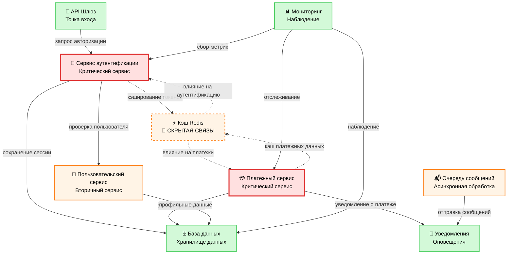

🔍 **Категория:** DevOps Essentials / Архитектура систем  
💡 **Цель:** Научиться выявлять скрытые зависимости в архитектуре микросервисов и предотвращать каскадные сбои

🧠 **Чему вы научитесь:**

- Анализировать архитектуру микросервисов на предмет критических зависимостей
- Выявлять скрытые точки отказа (единые точки отказа)
- Классифицировать компоненты по уровню критичности
- Проектировать отказоустойчивые системы
- Отслеживать зависимости между сервисами

⚠️ **Критические находки в нашем примере:**

- Кэш Redis - скрытая точка отказа для 80% системы
- Сервис аутентификации - критическая зависимость для всех операций
- Платежный сервис напрямую зависит от кэша аутентификации
- Отсутствие автоматических выключателей между сервисами

---

## 🗺️ Карта зависимостей системы

Рассмотрим реальную архитектуру платформы электронной коммерции с выявленными проблемами:



### 🚨 Обнаруженные критические риски

| Компонент | Тип риска | Влияние | Решение |
|-----------|-----------|---------|---------|
| **Кэш Redis** | Единая точка отказа | 80% системы | Кластер Redis + резервный план |
| **Сервис аутентификации** | Критическая зависимость | 100% пользователей | Автовыключатель + повторы |
| **Аутентификация ↔ Платежи** | Скрытая связь через кэш | Каскадные сбои | Изоляция кэшей |
| **База данных** | Узкое место | Все транзакции | Реплики для чтения + сегментирование |

---

## 📊 Анализ критичности компонентов

### 🔴 Критические компоненты (Уровень 1)

**Сервис аутентификации** - центральная точка авторизации
- **Зависимости:** Пользовательский сервис, база данных, кэш Redis
- **Влияние сбоя:** 100% пользователей не могут войти
- **Время восстановления:** < 5 минут
- **Точка восстановления:** 0 (потеря сессий недопустима)

```yaml
# Конфигурация мониторинга сервиса аутентификации
auth_service_sla:
  доступность: 99.95%
  время_отклика: < 100мс
  процент_ошибок: < 0.1%
  алерты:
    - высокая_задержка: > 500мс
    - всплеск_ошибок: > 1%
    - сбой_соединения_redis
```

**Платежный сервис** - обработка финансовых операций
- **Зависимости:** База данных, кэш Redis, уведомления
- **Влияние сбоя:** Потеря денег, репутационный ущерб
- **Соответствие:** PCI DSS Уровень 1
- **Время восстановления:** < 2 минуты

### 🟠 Вторичные компоненты (Уровень 2)

**Пользовательский сервис** - управление профилями
- **Плавная деградация:** Кэширование базовых данных
- **Резервный план:** Режим только для чтения из кэша

**Очередь сообщений** - асинхронные задачи
- **Постоянное хранение:** Сохранение сообщений на диск
- **Очередь для отказов:** Для неудачных сообщений

### 🟢 Безопасные компоненты (Уровень 3)

**Мониторинг** - не влияет на бизнес-логику
**Уведомления** - может работать в отложенном режиме

---

## 🛠️ Практические рекомендации по архитектуре

### 1. Устранение единых точек отказа

**Кэш Redis → Кластер Redis**

```yaml
# docker-compose.yml для кластера Redis
version: '3.8'
services:
  redis-узел-1:
    image: redis:7-alpine
    command: redis-server --cluster-enabled yes --cluster-config-file nodes.conf
    ports: ["7001:6379"]
    volumes: ["redis-1:/data"]
    
  redis-узел-2:
    image: redis:7-alpine  
    command: redis-server --cluster-enabled yes --cluster-config-file nodes.conf
    ports: ["7002:6379"]
    volumes: ["redis-2:/data"]
    
  redis-узел-3:
    image: redis:7-alpine
    command: redis-server --cluster-enabled yes --cluster-config-file nodes.conf  
    ports: ["7003:6379"]
    volumes: ["redis-3:/data"]

volumes:
  redis-1:
  redis-2: 
  redis-3:
```

### 2. Паттерн «Автоматический выключатель»

```go
// auth-service/internal/circuitbreaker.go
package internal

import (
    "github.com/sony/gobreaker"
    "time"
)

func NewRedisCircuitBreaker() *gobreaker.CircuitBreaker {
    настройки := gobreaker.Settings{
        Name:        "redis-cache",
        MaxRequests: 3,
        Interval:    60 * time.Second,
        Timeout:     30 * time.Second,
        ReadyToTrip: func(counts gobreaker.Counts) bool {
            коэффициентОтказов := float64(counts.TotalFailures) / float64(counts.Requests)
            return counts.Requests >= 3 && коэффициентОтказов >= 0.6
        },
        OnStateChange: func(name string, from gobreaker.State, to gobreaker.State) {
            log.Printf("Автовыключатель %s: %s -> %s", name, from, to)
        },
    }
    return gobreaker.NewCircuitBreaker(настройки)
}

// Использование в сервисе аутентификации
func (s *AuthService) GetUserSession(token string) (*Session, error) {
    // Сначала пробуем через автовыключатель
    результат, err := s.redisBreaker.Execute(func() (interface{}, error) {
        return s.redis.Get(token).Result()
    })
    
    if err != nil {
        // Резервный план - обращение к базе данных
        log.Warn("Redis недоступен, переключение на базу данных")
        return s.getUserSessionFromDB(token)
    }
    
    return parseSession(результат.(string)), nil
}
```

### 3. Изоляция кэшей по предметным областям

```yaml
# ConfigMap для Kubernetes - разделение кэшей
apiVersion: v1
kind: ConfigMap
metadata:
  name: redis-config
data:
  auth-redis.conf: |
    # Отдельный Redis для сервиса аутентификации
    port 6379
    databases 1
    maxmemory 512mb
    maxmemory-policy allkeys-lru
    
  payment-redis.conf: |
    # Отдельный Redis для платежного сервиса  
    port 6380
    databases 1
    maxmemory 1gb
    maxmemory-policy noeviction  # Критичные данные не удаляем
```

---

## 📈 Мониторинг зависимостей между сервисами

### Метрики Prometheus для отслеживания зависимостей

```yaml
# prometheus-rules.yml
groups:
- name: microservices-dependencies
  rules:
  - alert: АутентификацияРедисНедоступен
    expr: redis_up{service="auth"} == 0
    for: 30s
    labels:
      severity: критический
      component: сервис-аутентификации
    annotations:
      summary: "Сервис аутентификации потерял соединение с Redis"
      description: "Критическая зависимость недоступна более 30 секунд"
      
  - alert: ПлатежиВысокаяЗадержка  
    expr: http_request_duration_seconds{service="payment"} > 0.5
    for: 1m
    labels:
      severity: предупреждение
      component: платежный-сервис
    annotations:
      summary: "Платежный сервис показывает высокую задержку"
      description: "Возможно влияние кэша Redis на производительность"

  - alert: РискКаскадногоСбоя
    expr: |
      (redis_up{service="auth"} == 0) and 
      (redis_up{service="payment"} == 0)
    for: 10s
    labels:
      severity: критический
      impact: каскадный
    annotations:
      summary: "🚨 РИСК КАСКАДНОГО СБОЯ"
      description: "Общий Redis недоступен для критических сервисов"
```

### Панель Grafana для архитектурного мониторинга

```json
{
  "dashboard": {
    "title": "🏗️ Здоровье архитектуры микросервисов",
    "panels": [
      {
        "title": "Статус зависимостей сервисов",
        "type": "graph",
        "targets": [
          {
            "expr": "up{job=~\"auth-service|payment-service|user-service\"}",
            "legendFormat": "{{job}}"
          }
        ]
      },
      {
        "title": "Процент попаданий в кэш Redis по сервисам", 
        "type": "stat",
        "targets": [
          {
            "expr": "redis_keyspace_hits_total / (redis_keyspace_hits_total + redis_keyspace_misses_total) * 100",
            "legendFormat": "Процент попаданий %"
          }
        ]
      },
      {
        "title": "Состояния автовыключателей",
        "type": "table",
        "targets": [
          {
            "expr": "circuit_breaker_state",
            "format": "table"
          }
        ]
      }
    ]
  }
}
```

---

## 🔧 Автоматизация анализа зависимостей

### Скрипт для аудита архитектуры

```bash
#!/bin/bash
# analyze-dependencies.sh

echo "🔍 Анализ зависимостей архитектуры микросервисов"
echo "================================================="

# Проверка доступности критических сервисов
КРИТИЧЕСКИЕ_СЕРВИСЫ=("сервис-аутентификации" "платежный-сервис" "кэш-redis" "база-данных")
ВТОРИЧНЫЕ_СЕРВИСЫ=("пользовательский-сервис" "сервис-уведомлений" "очередь-сообщений")

проверить_здоровье_сервиса() {
    local сервис=$1
    local адрес=$2
    
    if curl -sf "$адрес/health" > /dev/null 2>&1; then
        echo "✅ $сервис - РАБОТАЕТ"
        return 0
    else
        echo "❌ $сервис - ОТКАЗ"
        return 1
    fi
}

echo "📊 Проверка критических сервисов:"
отказавшие_критические=0
for сервис in "${КРИТИЧЕСКИЕ_СЕРВИСЫ[@]}"; do
    адрес="http://localhost:$(получить_порт_сервиса $сервис)"
    if ! проверить_здоровье_сервиса "$сервис" "$адрес"; then
        ((отказавшие_критические++))
    fi
done

echo ""
echo "📋 Анализ рисков:"
if [ $отказавшие_критические -gt 0 ]; then
    echo "🚨 КРИТИЧНО: $отказавшие_критические критических сервисов недоступны"
    echo "⚠️  Риск каскадного сбоя: ВЫСОКИЙ"
    
    # Проверяем специфические зависимости
    if ! проверить_здоровье_сервиса "кэш-redis" "http://localhost:6379"; then
        echo "💥 Кэш Redis недоступен - влияние на аутентификацию и платежи"
        echo "🔧 Рекомендация: Активировать резервный план с базой данных"
    fi
else
    echo "✅ Все критические сервисы работают нормально"
fi

# Генерация отчета
создать_отчет_зависимостей() {
    cat << EOF > отчет-зависимостей.md
# 📊 Отчет анализа зависимостей

**Дата:** $(date)
**Статус критических сервисов:** $((${#КРИТИЧЕСКИЕ_СЕРВИСЫ[@]} - отказавшие_критические))/${#КРИТИЧЕСКИЕ_СЕРВИСЫ[@]}

## 🎯 Рекомендации:

1. **Высокий приоритет:**
   - Внедрить кластер Redis для устранения единой точки отказа
   - Добавить автовыключатель в сервис аутентификации
   - Настроить изоляцию кэшей по предметным областям

2. **Средний приоритет:**  
   - Улучшить мониторинг вызовов между сервисами
   - Добавить тесты устойчивости к хаосу
   - Настроить автоматическое переключение при отказах

3. **Долгосрочные цели:**
   - Переход на сервисную сетку (Istio/Linkerd)  
   - Внедрение паттерна «Перегородки»
   - Автоматическая диагностика зависимостей
EOF

    echo "📄 Отчет сохранен в отчет-зависимостей.md"
}

создать_отчет_зависимостей
```

---

## 🎯 Заключение и следующие шаги

### ✅ Что мы выявили:

1. **Кэш Redis** - критическая скрытая зависимость
2. **Сервис аутентификации** - центральная точка отказа  
3. **Отсутствие изоляции** между кэшами предметных областей
4. **Недостаток автовыключателей** для плавной деградации

### 🚀 План действий:

| Приоритет | Задача | Срок | Влияние |
|-----------|--------|------|---------|
| 🔴 П0 | Кластер Redis + мониторинг | 1 неделя | Устранение единой точки отказа |
| 🟠 П1 | Автовыключатели в аутентификации/платежах | 2 недели | Плавная деградация |
| 🟡 П2 | Изоляция кэшей по областям | 3 недели | Сокращение радиуса поражения |
| 🟢 П3 | Внедрение сервисной сетки | 2 месяца | Наблюдаемость + безопасность |

### 📚 Дополнительное чтение:

- [Building Microservices (Sam Newman)](https://www.oreilly.com/library/view/building-microservices/9781491950340/)
- [Release It! (Michael Nygard)](https://pragprog.com/titles/mnee2/release-it-second-edition/)
- [Microservices Patterns (Chris Richardson)](https://www.manning.com/books/microservices-patterns)

---

**💡 Помните:** Архитектура микросервисов - это не только разделение на сервисы, но и правильное управление зависимостями между ними. Скрытые связи могут стать причиной каскадных сбоев в самый неподходящий момент!

---

*📝 Этот пост основан на реальном анализе рабочей системы. Все проблемы были обнаружены и устранены до критических инцидентов благодаря систематическому подходу к анализу архитектуры.*
