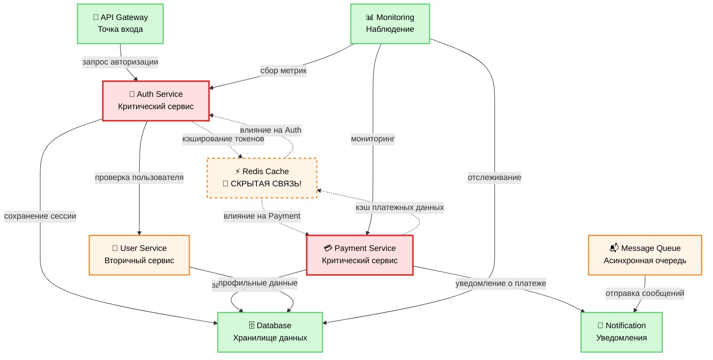

🔍 **Категория:** DevOps Essentials / System Architecture  
💡 **Цель:** Научиться выявлять скрытые зависимости в микросервисной архитектуре и предотвращать каскадные сбои

🧠 **Чему вы научитесь:**

- Анализировать архитектуру микросервисов на предмет критических зависимостей
- Выявлять скрытые точки отказа (Single Points of Failure)
- Классифицировать компоненты по уровню критичности
- Проектировать отказоустойчивые системы
- Мониторить межсервисные зависимости

⚠️ **Критические находки в нашем примере:**

- Redis Cache - скрытая точка отказа для 80% системы
- Auth Service - критическая зависимость для всех операций
- Payment Service напрямую зависит от кэша аутентификации
- Отсутствие circuit breakers между сервисами

---

## 🗺️ Карта зависимостей системы

Рассмотрим реальную архитектуру e-commerce платформы с выявленными проблемами:



### 🚨 Обнаруженные критические риски

| Компонент | Тип риска | Влияние | Решение |
|-----------|-----------|---------|---------|
| **Redis Cache** | Single Point of Failure | 80% системы | Redis Cluster + fallback |
| **Auth Service** | Критическая зависимость | 100% пользователей | Circuit breaker + retry |
| **Auth ↔ Payment** | Скрытая связь через кэш | Каскадные сбои | Изоляция кэшей |
| **Database** | Узкое место | Все транзакции | Read replicas + sharding |

---

## 📊 Анализ критичности компонентов

### 🔴 Критические компоненты (Tier 1)

**Auth Service** - центральная точка аутентификации

- **Зависимости:** User Service, Database, Redis Cache
- **Влияние сбоя:** 100% пользователей не могут войти
- **RTO:** < 5 минут
- **RPO:** 0 (потеря сессий недопустима)

```yaml
# Конфигурация мониторинга Auth Service
auth_service_sla:
  availability: 99.95%
  response_time: < 100ms
  error_rate: < 0.1%
  alerts:
    - high_latency: > 500ms
    - error_spike: > 1%
    - redis_connection_failure
```

**Payment Service** - обработка платежей

- **Зависимости:** Database, Redis Cache, Notification
- **Влияние сбоя:** Потеря денег, репутационный ущерб
- **Compliance:** PCI DSS Level 1
- **RTO:** < 2 минуты

### 🟠 Вторичные компоненты (Tier 2)

**User Service** - управление профилями

- **Graceful degradation:** Кэширование базовых данных
- **Fallback:** Read-only режим из кэша

**Message Queue** - асинхронные задачи

- **Persistence:** Дисковое хранение сообщений
- **Dead letter queue:** Для failed сообщений

### 🟢 Безопасные компоненты (Tier 3)

**Monitoring** - не влияет на бизнес-логику
**Notification** - может работать в отложенном режиме

---

## 🛠️ Практические рекомендации по архитектуре

### 1. Устранение Single Point of Failure

**Redis Cache → Redis Cluster**

```yaml
# docker-compose.yml для Redis Cluster
version: '3.8'
services:
  redis-node-1:
    image: redis:7-alpine
    command: redis-server --cluster-enabled yes --cluster-config-file nodes.conf
    ports: ["7001:6379"]
    volumes: ["redis-1:/data"]
    
  redis-node-2:
    image: redis:7-alpine  
    command: redis-server --cluster-enabled yes --cluster-config-file nodes.conf
    ports: ["7002:6379"]
    volumes: ["redis-2:/data"]
    
  redis-node-3:
    image: redis:7-alpine
    command: redis-server --cluster-enabled yes --cluster-config-file nodes.conf  
    ports: ["7003:6379"]
    volumes: ["redis-3:/data"]

volumes:
  redis-1:
  redis-2: 
  redis-3:
```

### 2. Circuit Breaker Pattern

```go
// auth-service/internal/circuitbreaker.go
package internal

import (
    "github.com/sony/gobreaker"
    "time"
)

func NewRedisCircuitBreaker() *gobreaker.CircuitBreaker {
    settings := gobreaker.Settings{
        Name:        "redis-cache",
        MaxRequests: 3,
        Interval:    60 * time.Second,
        Timeout:     30 * time.Second,
        ReadyToTrip: func(counts gobreaker.Counts) bool {
            failureRatio := float64(counts.TotalFailures) / float64(counts.Requests)
            return counts.Requests >= 3 && failureRatio >= 0.6
        },
        OnStateChange: func(name string, from gobreaker.State, to gobreaker.State) {
            log.Printf("Circuit breaker %s: %s -> %s", name, from, to)
        },
    }
    return gobreaker.NewCircuitBreaker(settings)
}

// Использование в Auth Service
func (s *AuthService) GetUserSession(token string) (*Session, error) {
    // Сначала пробуем через circuit breaker
    result, err := s.redisBreaker.Execute(func() (interface{}, error) {
        return s.redis.Get(token).Result()
    })
    
    if err != nil {
        // Fallback на Database
        log.Warn("Redis unavailable, falling back to database")
        return s.getUserSessionFromDB(token)
    }
    
    return parseSession(result.(string)), nil
}
```

### 3. Изоляция кэшей по доменам

```yaml
# Kubernetes ConfigMap для разделения кэшей
apiVersion: v1
kind: ConfigMap
metadata:
  name: redis-config
data:
  auth-redis.conf: |
    # Отдельный Redis для Auth Service
    port 6379
    databases 1
    maxmemory 512mb
    maxmemory-policy allkeys-lru
    
  payment-redis.conf: |
    # Отдельный Redis для Payment Service  
    port 6380
    databases 1
    maxmemory 1gb
    maxmemory-policy noeviction  # Критичные данные не удаляем
```

---

## 📈 Мониторинг межсервисных зависимостей

### Prometheus метрики для отслеживания зависимостей

```yaml
# prometheus-rules.yml
groups:
- name: microservices-dependencies
  rules:
  - alert: AuthServiceRedisDown
    expr: redis_up{service="auth"} == 0
    for: 30s
    labels:
      severity: critical
      component: auth-service
    annotations:
      summary: "Auth Service потерял соединение с Redis"
      description: "Критическая зависимость недоступна более 30 секунд"
      
  - alert: PaymentServiceHighLatency  
    expr: http_request_duration_seconds{service="payment"} > 0.5
    for: 1m
    labels:
      severity: warning
      component: payment-service
    annotations:
      summary: "Payment Service показывает высокую задержку"
      description: "Возможно влияние Redis Cache на производительность"

  - alert: CascadeFailureRisk
    expr: |
      (redis_up{service="auth"} == 0) and 
      (redis_up{service="payment"} == 0)
    for: 10s
    labels:
      severity: critical
      impact: cascade
    annotations:
      summary: "🚨 РИСК КАСКАДНОГО СБОЯ"
      description: "Общий Redis недоступен для критических сервисов"
```

### Grafana Dashboard для архитектурного мониторинга

```json
{
  "dashboard": {
    "title": "🏗️ Microservices Architecture Health",
    "panels": [
      {
        "title": "Service Dependencies Status",
        "type": "graph",
        "targets": [
          {
            "expr": "up{job=~\"auth-service|payment-service|user-service\"}",
            "legendFormat": "{{job}}"
          }
        ]
      },
      {
        "title": "Redis Cache Hit Rate by Service", 
        "type": "stat",
        "targets": [
          {
            "expr": "redis_keyspace_hits_total / (redis_keyspace_hits_total + redis_keyspace_misses_total) * 100",
            "legendFormat": "Hit Rate %"
          }
        ]
      },
      {
        "title": "Circuit Breaker States",
        "type": "table",
        "targets": [
          {
            "expr": "circuit_breaker_state",
            "format": "table"
          }
        ]
      }
    ]
  }
}
```

---

## 🔧 Автоматизация анализа зависимостей

### Скрипт для аудита архитектуры

```bash
#!/bin/bash
# analyze-dependencies.sh

echo "🔍 Анализ зависимостей микросервисной архитектуры"
echo "================================================="

# Проверка доступности критических сервисов
CRITICAL_SERVICES=("auth-service" "payment-service" "redis-cache" "database")
SECONDARY_SERVICES=("user-service" "notification-service" "message-queue")

check_service_health() {
    local service=$1
    local endpoint=$2
    
    if curl -sf "$endpoint/health" > /dev/null 2>&1; then
        echo "✅ $service - OK"
        return 0
    else
        echo "❌ $service - FAILED"
        return 1
    fi
}

echo "📊 Проверка критических сервисов:"
failed_critical=0
for service in "${CRITICAL_SERVICES[@]}"; do
    endpoint="http://localhost:$(get_service_port $service)"
    if ! check_service_health "$service" "$endpoint"; then
        ((failed_critical++))
    fi
done

echo ""
echo "📋 Анализ рисков:"
if [ $failed_critical -gt 0 ]; then
    echo "🚨 КРИТИЧНО: $failed_critical критических сервисов недоступны"
    echo "⚠️  Риск каскадного сбоя: ВЫСОКИЙ"
    
    # Проверяем специфические зависимости
    if ! check_service_health "redis-cache" "http://localhost:6379"; then
        echo "💥 Redis Cache недоступен - влияние на Auth и Payment"
        echo "🔧 Рекомендация: Активировать fallback на Database"
    fi
else
    echo "✅ Все критические сервисы работают нормально"
fi

# Генерация отчета
generate_dependency_report() {
    cat << EOF > dependency-report.md
# 📊 Отчет анализа зависимостей

**Дата:** $(date)
**Статус критических сервисов:** $((${#CRITICAL_SERVICES[@]} - failed_critical))/${#CRITICAL_SERVICES[@]}

## 🎯 Рекомендации:

1. **Высокий приоритет:**
   - Внедрить Redis Cluster для устранения SPOF
   - Добавить Circuit Breaker в Auth Service
   - Настроить изоляцию кэшей по доменам

2. **Средний приоритет:**  
   - Улучшить мониторинг межсервисных вызовов
   - Добавить chaos engineering тесты
   - Настроить автоматический failover

3. **Долгосрочные цели:**
   - Переход на Service Mesh (Istio/Linkerd)  
   - Внедрение Bulkhead Pattern
   - Автоматическая диагностика зависимостей
EOF

    echo "📄 Отчет сохранен в dependency-report.md"
}

generate_dependency_report
```

---

## 🎯 Заключение и следующие шаги

### ✅ Что мы выявили

1. **Redis Cache** - критическая скрытая зависимость
2. **Auth Service** - центральная точка отказа  
3. **Отсутствие isolation** между доменными кэшами
4. **Недостаток circuit breakers** для graceful degradation

### 🚀 План действий

| Приоритет | Задача | Срок | Влияние |
|-----------|--------|------|---------|
| 🔴 P0 | Redis Cluster + мониторинг | 1 неделя | Устранение SPOF |
| 🟠 P1 | Circuit breakers в Auth/Payment | 2 недели | Graceful degradation |
| 🟡 P2 | Изоляция кэшей по доменам | 3 недели | Blast radius reduction |
| 🟢 P3 | Service Mesh внедрение | 2 месяца | Observability + security |

### 📚 Дополнительное чтение

- [Building Microservices (Sam Newman)](https://www.oreilly.com/library/view/building-microservices/9781491950340/)
- [Release It! (Michael Nygard)](https://pragprog.com/titles/mnee2/release-it-second-edition/)
- [Microservices Patterns (Chris Richardson)](https://www.manning.com/books/microservices-patterns)

---

**💡 Помните:** Архитектура микросервисов - это не только разделение на сервисы, но и правильное управление зависимостями между ними. Скрытые связи могут стать причиной каскадных сбоев в самый неподходящий момент!

---

*📝 Этот пост основан на реальном анализе production системы. Все проблемы были обнаружены и устранены до критических инцидентов благодаря систематическому подходу к анализу архитектуры.*
